# Turnkeeper - Architecture Documentation

## Table of Contents

- [System Overview](#system-overview)
- [Architecture Principles](#architecture-principles)
- [Layer Architecture](#layer-architecture)
- [Domain Model](#domain-model)
- [Authentication & Authorization](#authentication--authorization)
- [Data Flow](#data-flow)
- [API Design](#api-design)
- [WebSocket Communication](#websocket-communication)

## System Overview

Turnkeeper is a turn-based game management system that allows Game Masters (GMs) to create and manage games while multiple users can connect and participate. The system follows clean architecture principles with a clear separation between domain, application, and infrastructure layers.

## Architecture Principles

### Clean Architecture

The backend follows clean architecture principles with three distinct layers:

1. **Domain Layer** - Pure business logic, no external dependencies, except Uuid
2. **Application Layer** - Use cases and orchestration via Request/Event Handlers
3. **Infrastructure Layer** - External concerns (HTTP, WebSockets, Database, Auth)

### Dependency Rule

Dependencies flow inward: Infrastructure → Application → Domain. The domain layer has no dependencies on outer layers.

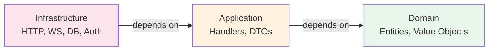

## Layer Architecture

### Domain Layer

The domain layer contains pure business logic with entities, value objects, and domain events.

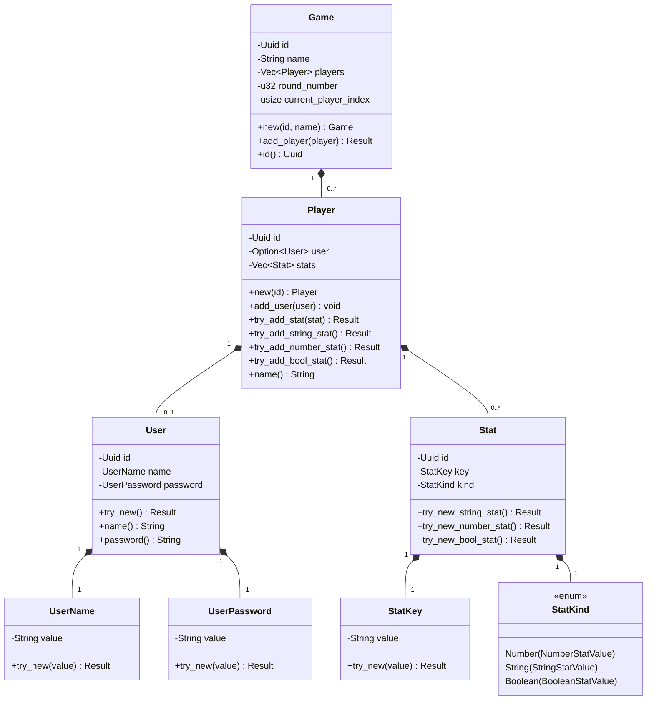

### Application Layer

The application layer implements use cases through Request Handlers (for HTTP requests) and Event Handlers (for WebSocket events).

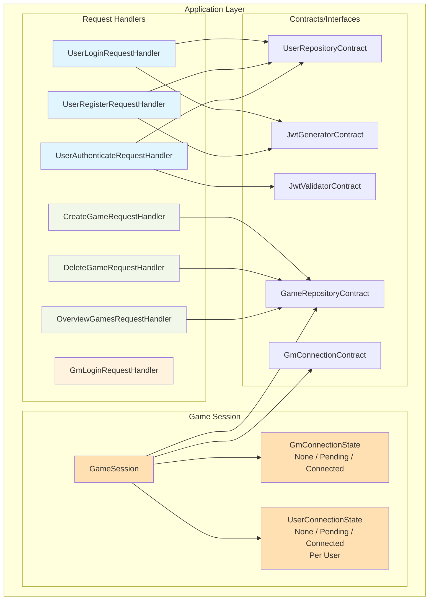

### Infrastructure Layer

The infrastructure layer handles external concerns.

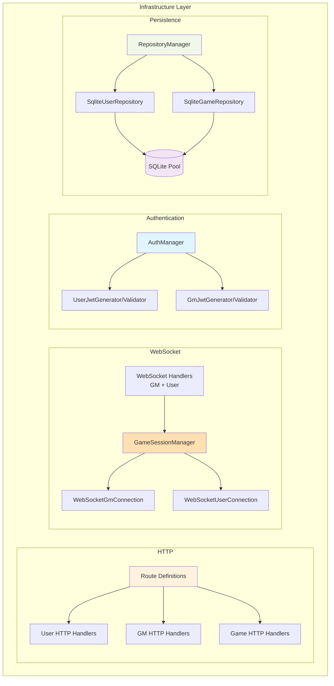

## Domain Model

### Entity Relationships

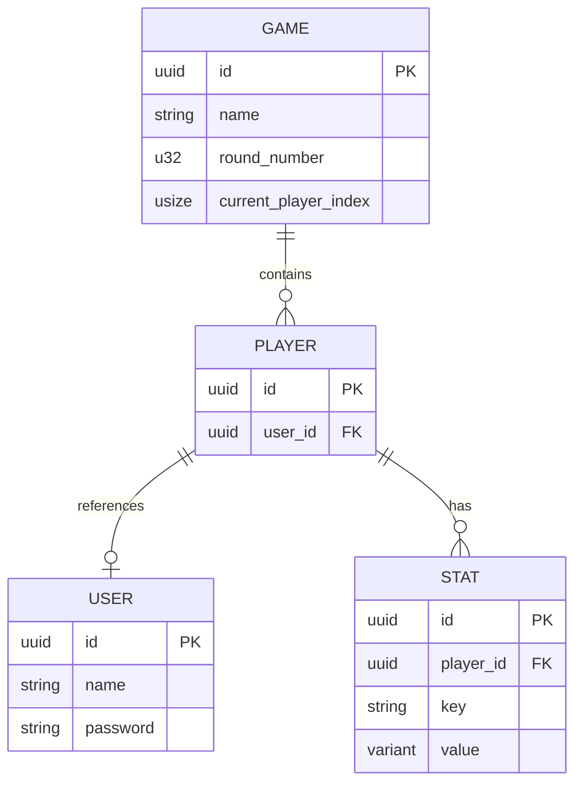

### Aggregate Boundaries

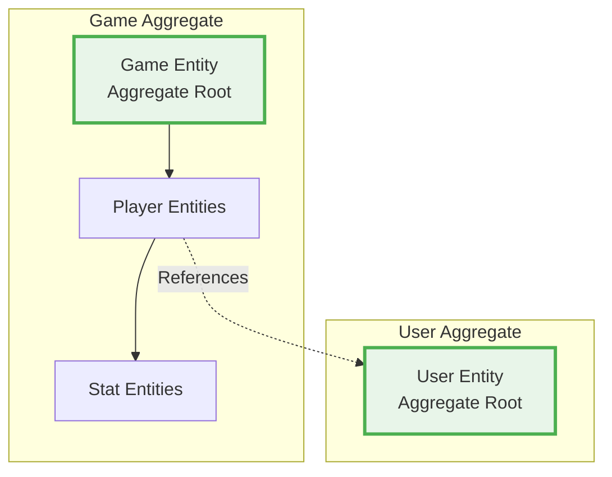

## Client Connection

Client connection is handled in two ways:

1. REST Api - RequestHandlers
2. Websockets - GameSession

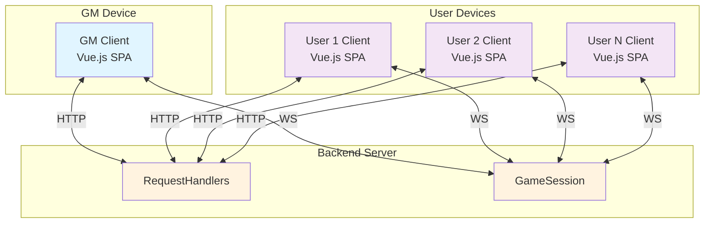

## Authentication & Authorization

### Authentication Flow - GM

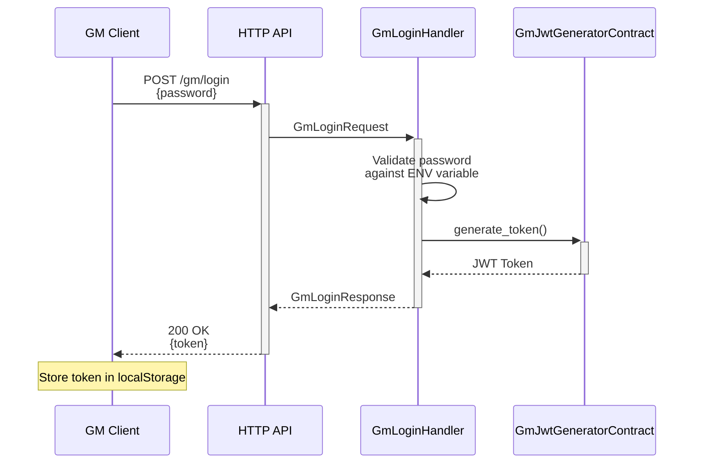

### Authentication Flow - User

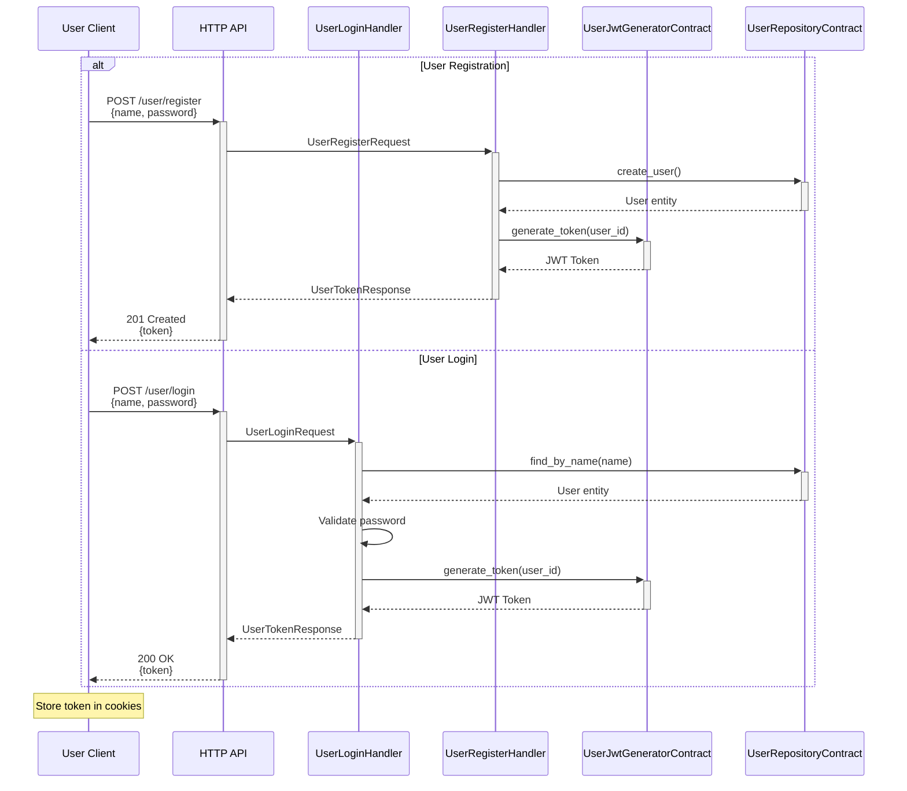

### Authorization Middleware

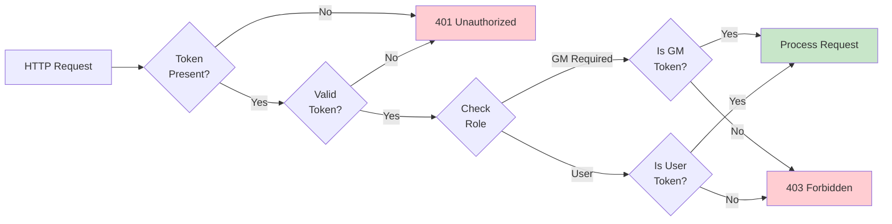

## Data Flow

### HTTP Request Flow

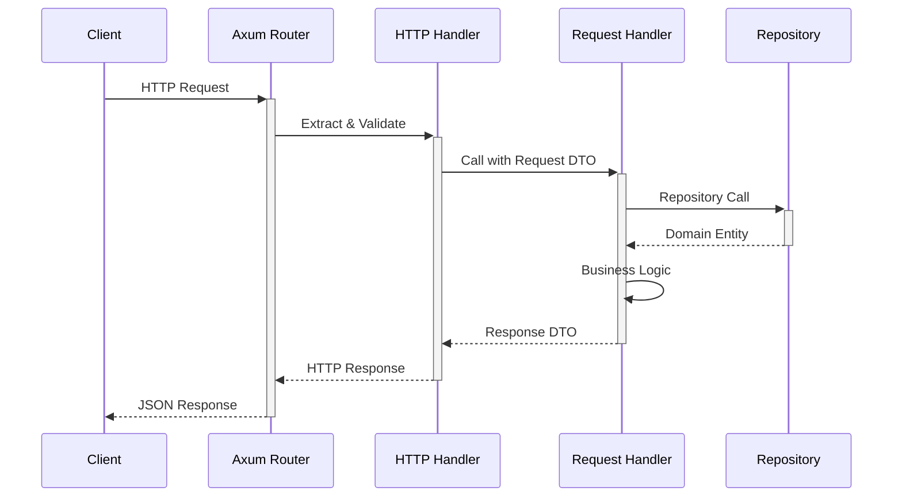

### WebSocket Connection & Event Flow

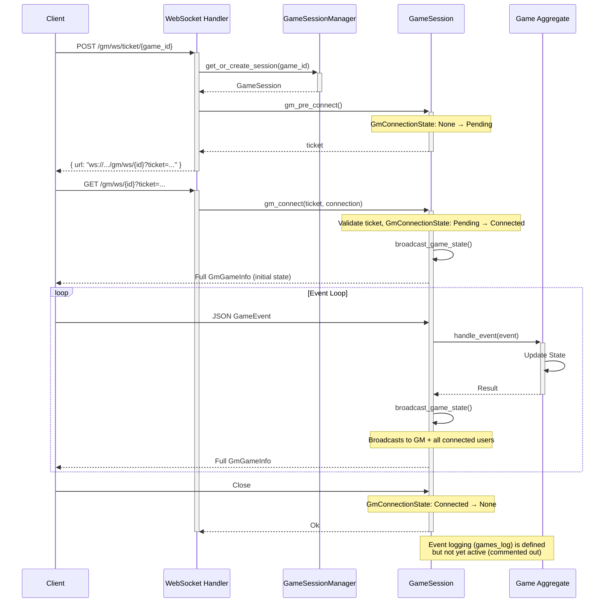

### User WebSocket Connection Flow

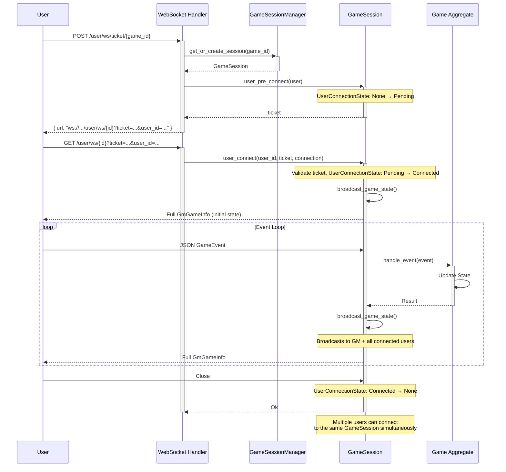

## Error Handling

### Error Propagation

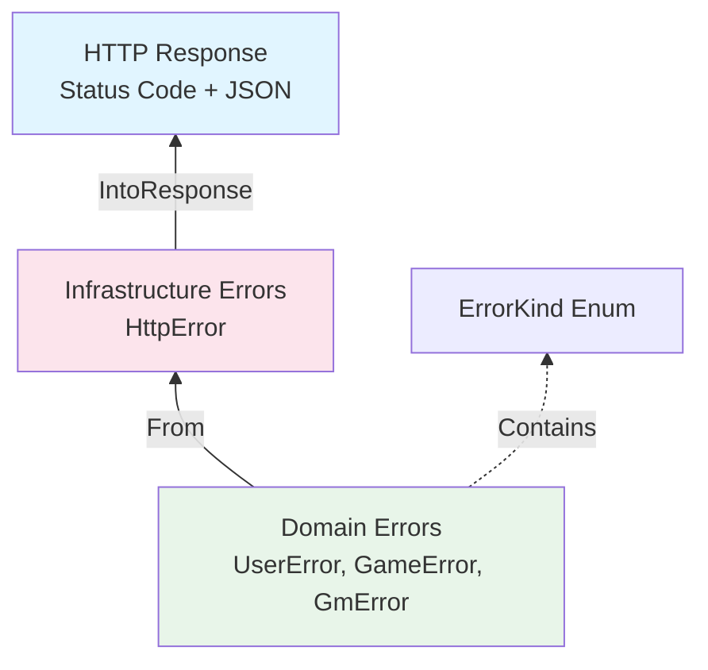

## Key Design Decisions

### 1. UUID as Primary Keys

UUIDs are used for all entity IDs because:

- Allows easy generation
- No need for database round-trips to get IDs

### 2. Request/Response vs Event

- **HTTP**: Request → Handler → Response (stateless)
- **WebSocket**: GameEvent → Handler → Apply to Game → Full State Response

### 3. Current WebSocket Events

The `GameEvent` enum currently supports:

- `AddPlayer` — adds an anonymous player
- `ChangePlayerOrder(Vec<String>)` — reorders players by UUID
- `Debug(String)` — prints a debug message to the server console

### 4. Unimplemented / Partial Features

The following are defined in code but not yet fully functional:

- `SqliteGameRepository::delete()` — will panic (`todo!()`)
- `SqliteGameRepository::log_event()` / `get_game_history()` — event sourcing persistence (`todo!()`)
- Event logging in `GameSession::handle_event()` — the `log_event()` call is commented out
- `GameEvent::is_user_permitted()` — defined but never enforced; user clients can send all events
- User frontend game view — WebSocket connection is established but no `GamePage` component exists to display game state after connecting
