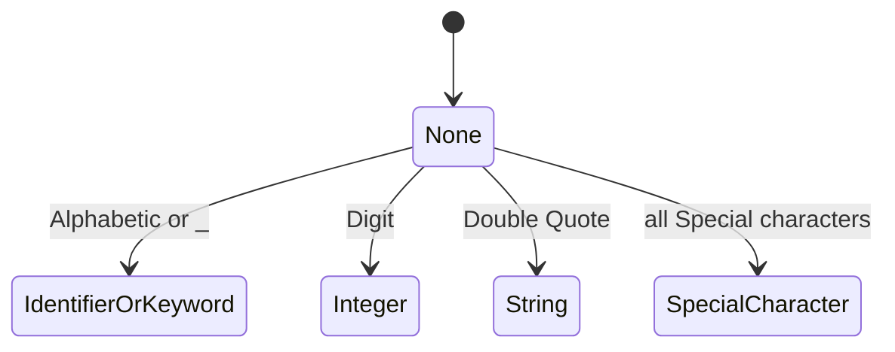
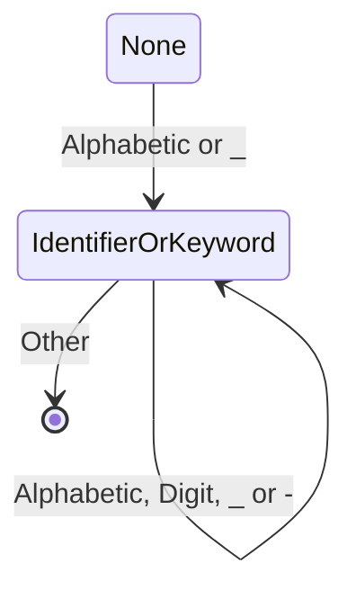
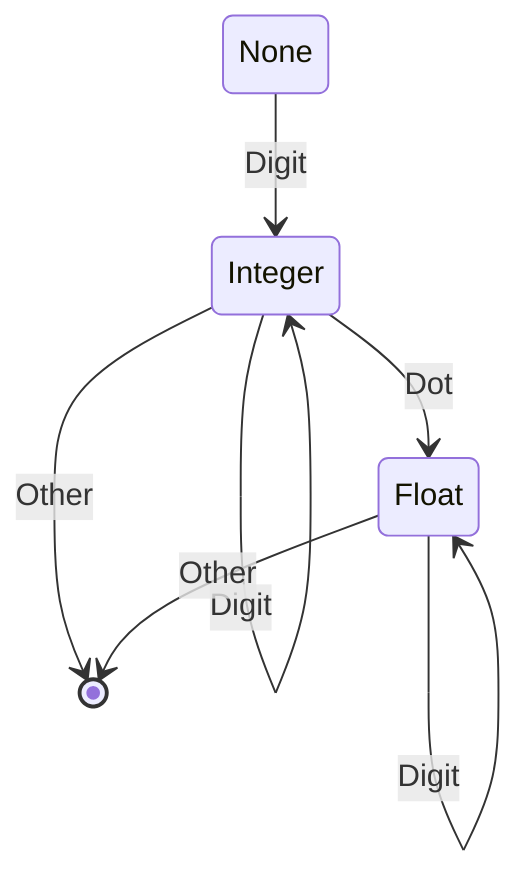
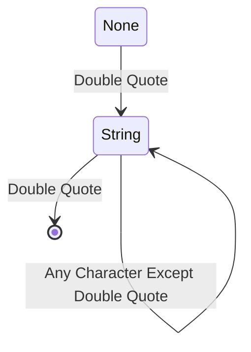
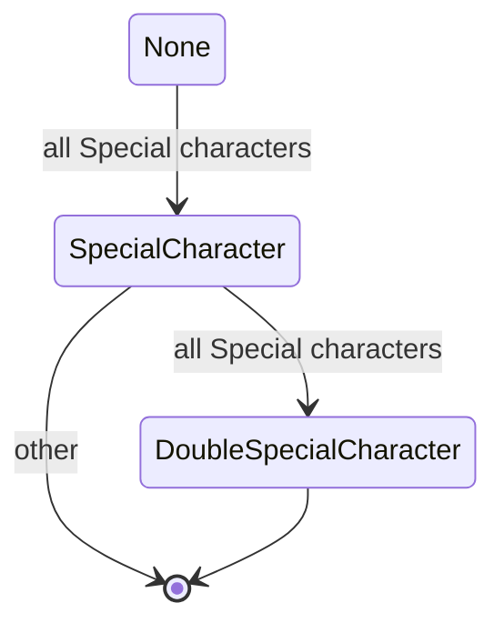

# Scanner State

The scanner scans the code and turns it into lexemes, to be further processed by the evaluator.

It is based on a finite state machine.

### Overview

### IdentifierOrKeyword

### Integer

### String

## Special Character

