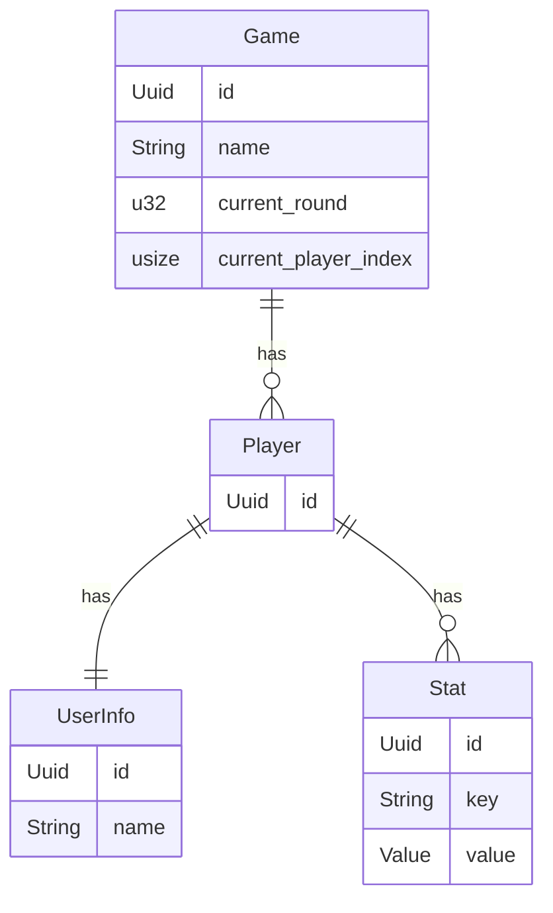

# Design Considerations

## Uuids

Because the chance of two UUIDs colliding is astronomically low, we do not check for duplicate UUIDs and treat each generated UUID as unique.

## Game

### User / UserInfo

The User is not part of the Aggregate. Auth / User management should be independent of the games. That's why a readonly UserInfo struct needs to be provided to the game. This way the game knows about the important details of the player (like username).

- The name might be changed while in game. Since only the display name is affected, we won't handle this possibility.
- Users can't be deleted while being part of a game. So we don't need to worry about the user when we have the UserInfo being outdated.
