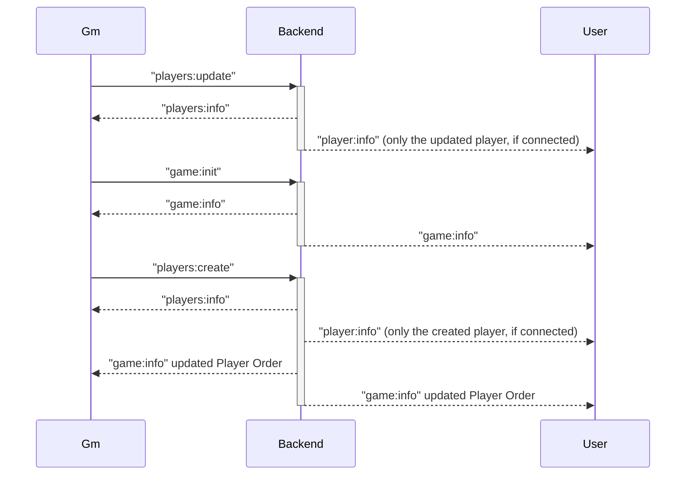
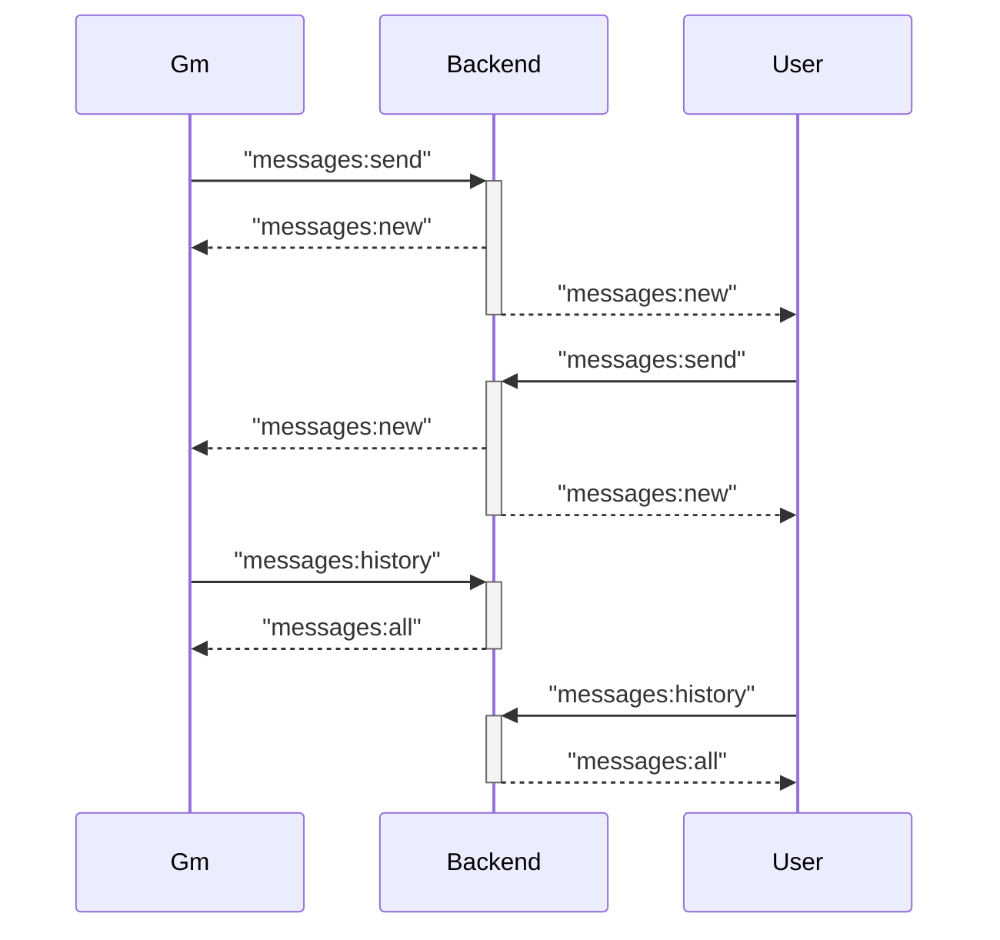
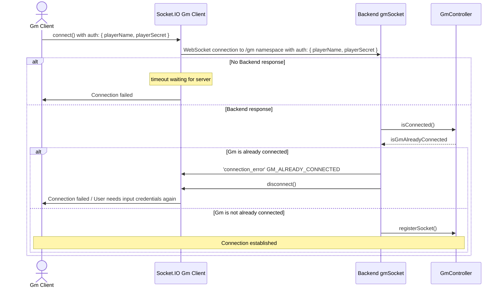
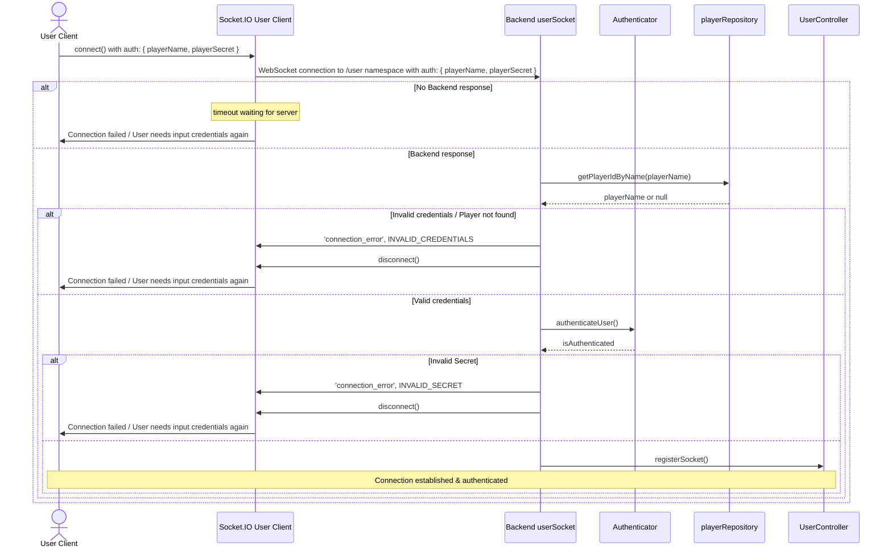

# Turnkeeper architecture

The Turnkeeper application is split into three parts: the backend, the game master (frontend) and the user (frontend). The game master and users are connecting to the backend via socket.io.

## Basic backend - gm/user socket event sequence

## Messages event sequence

## Gm connection

## User connection

