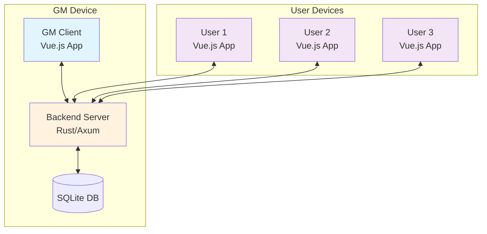
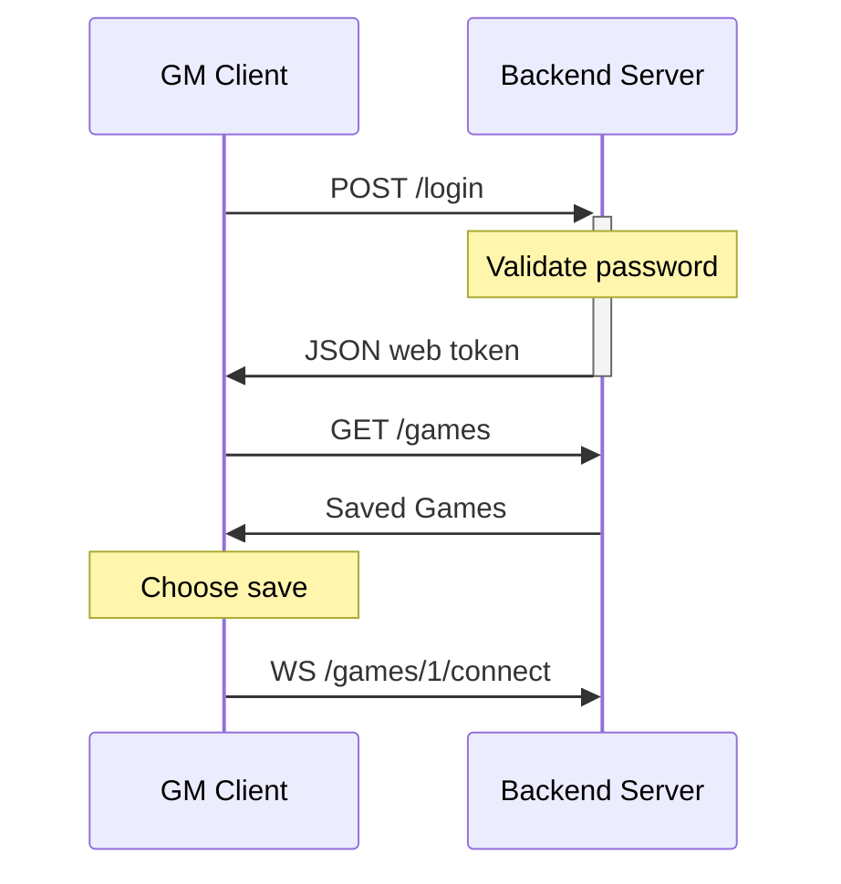
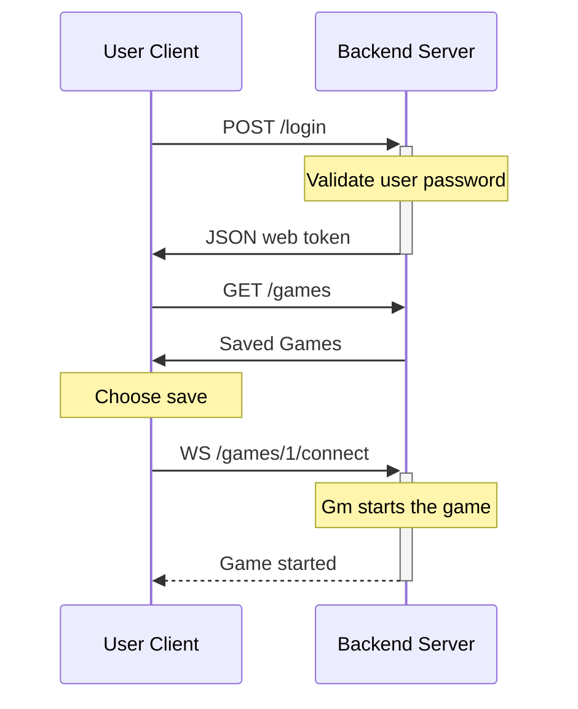
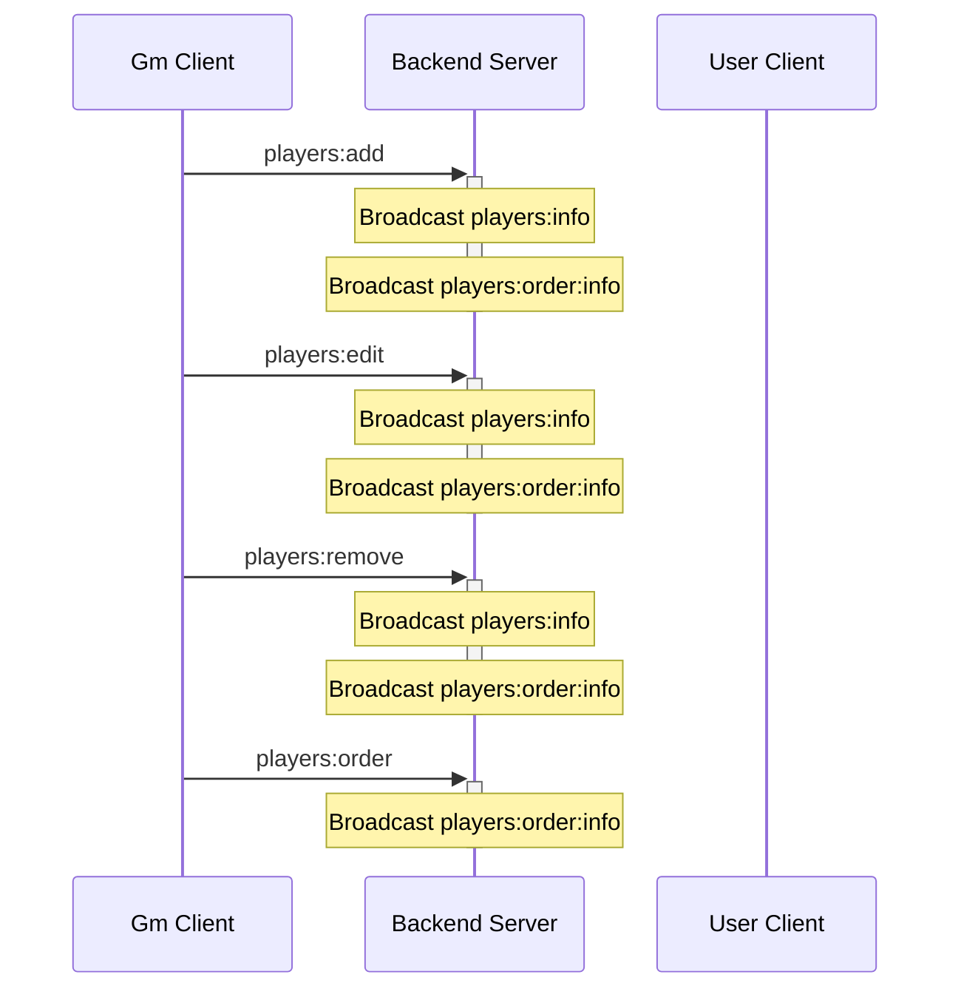
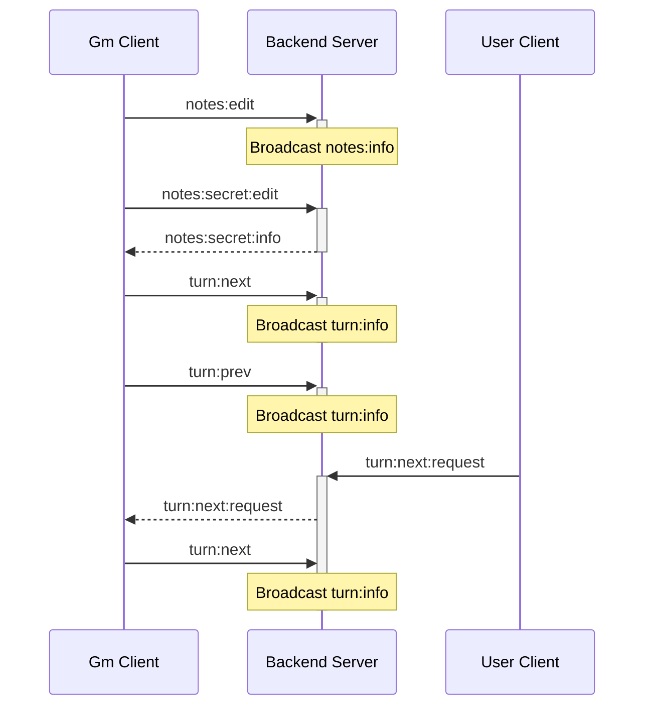
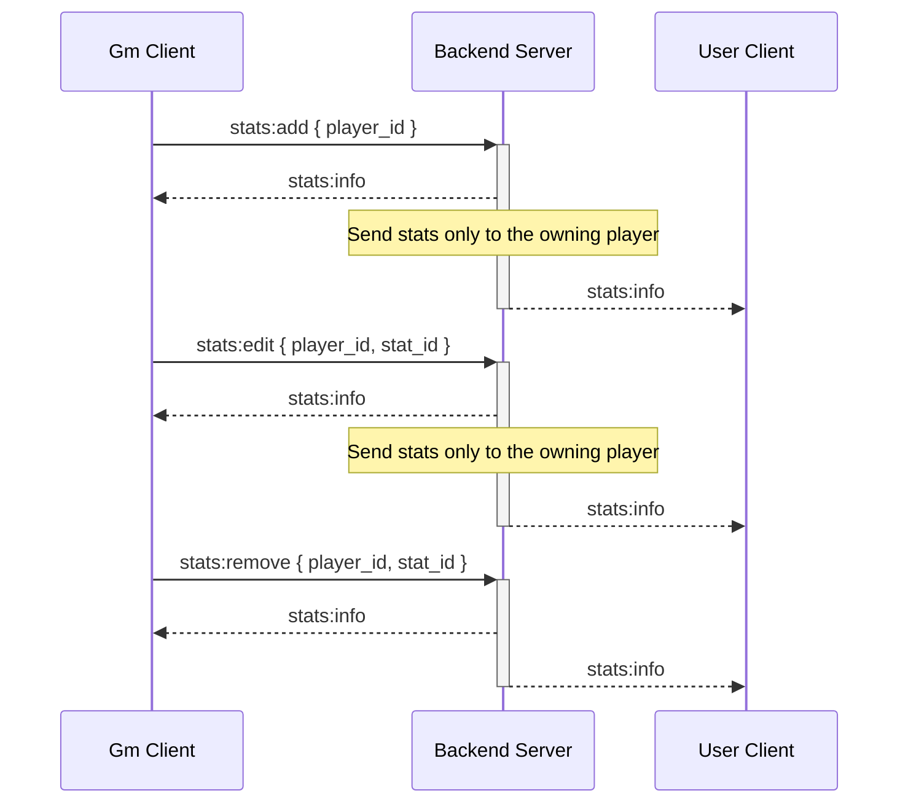
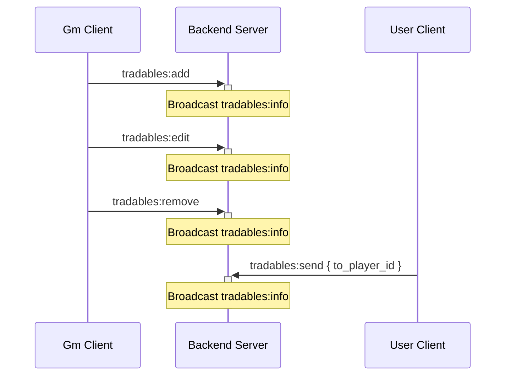
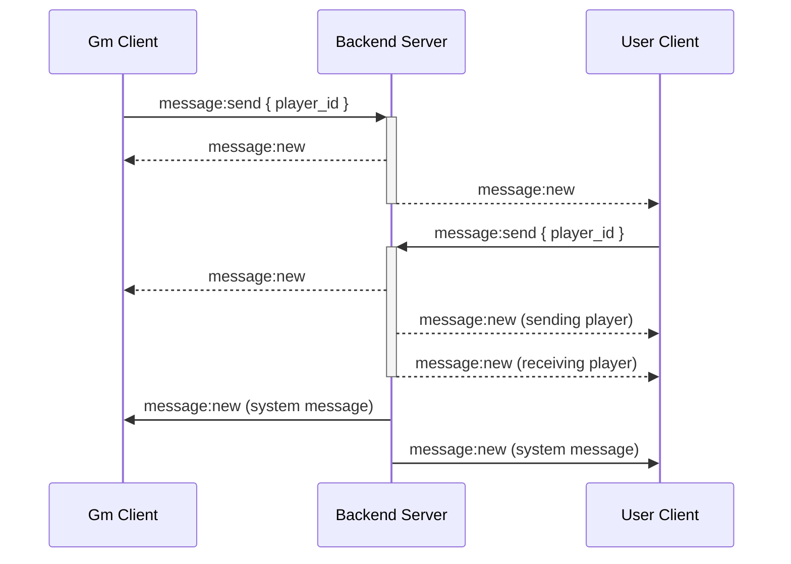

# Architecture

## System Overview

```mermaid
graph TB
    subgraph "GM Device"
        GM[GM Client<br/>Vue.js App]
        Backend[Backend Server<br/>Rust/Axum]
        DB[(SQLite DB)]

        GM <--> Backend
        Backend <--> DB
    end

    subgraph "User Devices"
        User1[User 1<br/>Vue.js App]
        User2[User 2<br/>Vue.js App]
        User3[User 3<br/>Vue.js App]
    end

    User1 <--> Backend
    User2 <--> Backend
    User3 <--> Backend

    style GM fill:#e1f5ff
    style Backend fill:#fff3e0
    style User1 fill:#f3e5f5
    style User2 fill:#f3e5f5
    style User3 fill:#f3e5f5
```

## Gm Auth / Game start

```mermaid
sequenceDiagram
    participant GM as GM Client
    participant Backend as Backend Server

    GM->>+Backend: POST /login
    note over Backend: Validate password
    Backend->>-GM: JSON web token

    GM->>Backend: GET /games
    Backend->>GM: Saved Games
    note over GM: Choose save

    GM->>Backend: WS /games/1/connect
```

## User Auth

```mermaid
sequenceDiagram
    participant User as User Client
    participant Backend as Backend Server

    User->>+Backend: POST /login
    note over Backend: Validate user password
    Backend->>-User: JSON web token

    User->>Backend: GET /games
    Backend->>User: Saved Games
    note over User: Choose save

    User->>+Backend: WS /games/1/connect

    note over Backend: Gm starts the game

    Backend-->>-User: Game started
```

## API HTTP Endpoints

### Auth

Only Auth routes are accessible unauthorized.

-   POST user/login -> JWT
-   POST user/register -> JWT
-   POST gm/login -> JWT

### Games

-   GET /games -> All game saves
-   Only Gm: POST /games -> Create new game
-   Only Gm: DELETE /games/:id -> Delete game

### User Management

-   Only Gm: GET /users
-   Only Gm: DELETE /users/:id
    -   A user can only be deleted if not currently a player in a game. First delete the game / player in the game.

## Websocket Connection

### Entrypoints

-   GM: /gm/connect/:game_id
-   USER: /user/connect/:game_id

## Websocket Events

-   Full arrow: some triggered event
-   Dotted arrow: event triggered by another event
    -   If to user: only to one user
-   Broadcast: to all users and the gm

### Player Management

```mermaid
sequenceDiagram
    participant Gm as Gm Client
    participant Backend as Backend Server
    participant User as User Client

    Gm->>+Backend: players:add
    note over Backend: Broadcast players:info
    note over Backend: Broadcast players:order:info
    deactivate Backend

    Gm->>+Backend: players:edit
    note over Backend: Broadcast players:info
    note over Backend: Broadcast players:order:info
    deactivate Backend

    Gm->>+Backend: players:remove
    note over Backend: Broadcast players:info
    note over Backend: Broadcast players:order:info
    deactivate Backend

    Gm->>+Backend: players:order
    note over Backend: Broadcast players:order:info
    deactivate Backend
```

### Game Management

```mermaid
sequenceDiagram
    participant Gm as Gm Client
    participant Backend as Backend Server
    participant User as User Client

    Gm->>+Backend: notes:edit
    note over Backend: Broadcast notes:info
    deactivate Backend

    Gm->>+Backend: notes:secret:edit
    Backend-->>-Gm: notes:secret:info

    Gm->>+Backend: turn:next
    note over Backend: Broadcast turn:info
    deactivate Backend

    Gm->>+Backend: turn:prev
    note over Backend: Broadcast turn:info
    deactivate Backend

    User->>+Backend: turn:next:request
    Backend-->>Gm: turn:next:request
    Gm->>Backend: turn:next
    note over Backend: Broadcast turn:info
    deactivate Backend
```

### Stats Management

```mermaid
sequenceDiagram
    participant Gm as Gm Client
    participant Backend as Backend Server
    participant User as User Client

    Gm->>+Backend: stats:add { player_id }
    Backend-->>Gm: stats:info
    note over Backend: Send stats only to the owning player
    Backend-->>-User: stats:info

    Gm->>+Backend: stats:edit { player_id, stat_id }
    Backend-->>Gm: stats:info
    note over Backend: Send stats only to the owning player
    Backend-->>-User: stats:info

    Gm->>+Backend: stats:remove { player_id, stat_id }
    Backend-->>Gm: stats:info
    Backend-->>-User: stats:info
```

### Tradable Management

Tradables are stats for all players, that can be traded. If it is changed by the gm, the gm must provide the values for all players. Players can send tradables between each other.

Tradables can be public or only own amount visible to the players.

```mermaid
sequenceDiagram
    participant Gm as Gm Client
    participant Backend as Backend Server
    participant User as User Client

    Gm->>+Backend: tradables:add
    note over Backend: Broadcast tradables:info
    deactivate Backend

    Gm->>+Backend: tradables:edit
    note over Backend: Broadcast tradables:info
    deactivate Backend

    Gm->>+Backend: tradables:remove
    note over Backend: Broadcast tradables:info
    deactivate Backend

    User->>+Backend: tradables:send { to_player_id }
    note over Backend: Broadcast tradables:info
    deactivate Backend
```

### Messages Management

```mermaid
sequenceDiagram
    participant Gm as Gm Client
    participant Backend as Backend Server
    participant User as User Client

    Gm->>+Backend: message:send { player_id }
    Backend-->>Gm: message:new
    Backend-->>-User: message:new

    User->>+Backend: message:send { player_id }
    Backend-->>Gm: message:new
    Backend-->>User: message:new (sending player)
    Backend-->>-User: message:new (receiving player)

    Backend->>Gm: message:new (system message)
    Backend->>User: message:new (system message)
```
