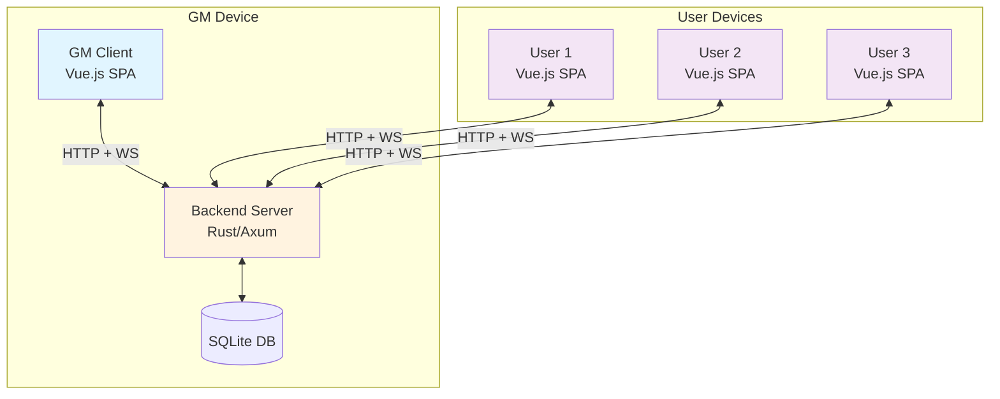
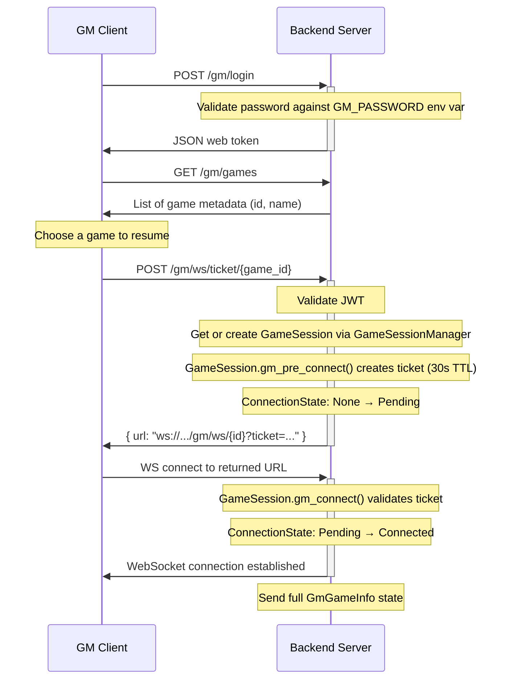
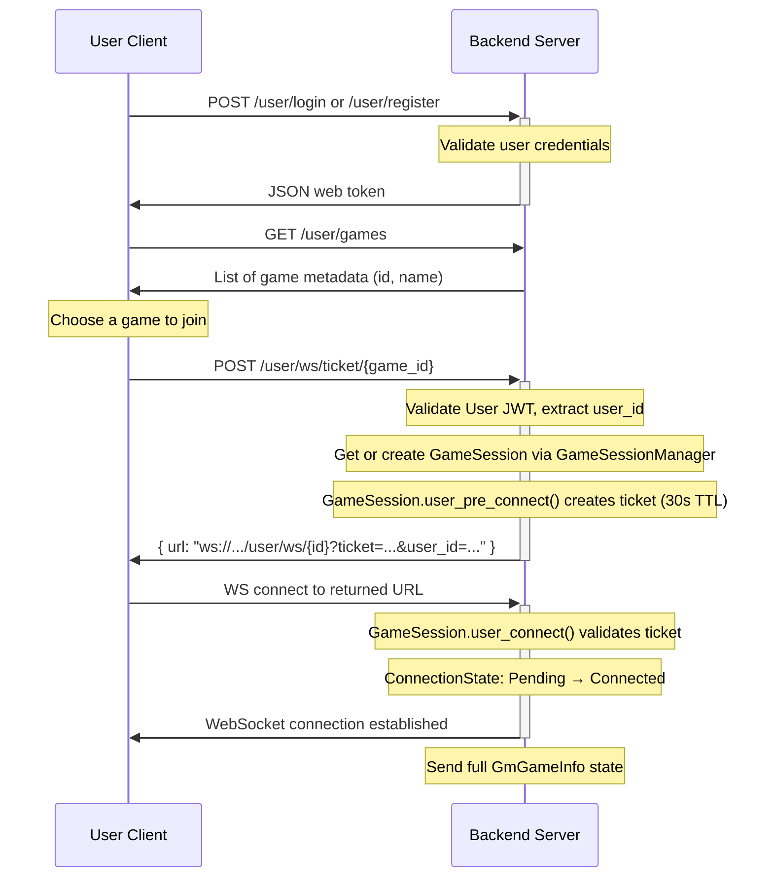

# Architecture

## System Overview


```mermaid
graph TB
    subgraph "GM Device"
        GM[GM Client<br/>Vue.js SPA]
        Backend[Backend Server<br/>Rust/Axum]
        DB[(SQLite DB)]

        GM <-->|HTTP + WS| Backend
        Backend <--> DB
    end

    subgraph "User Devices"
        User1[User 1<br/>Vue.js SPA]
        User2[User 2<br/>Vue.js SPA]
        User3[User 3<br/>Vue.js SPA]
    end

    User1 <-->|HTTP + WS| Backend
    User2 <-->|HTTP + WS| Backend
    User3 <-->|HTTP + WS| Backend

    style GM fill:#e1f5ff
    style Backend fill:#fff3e0
    style User1 fill:#f3e5f5
    style User2 fill:#f3e5f5
    style User3 fill:#f3e5f5
```

## GM Auth / Game Start


```mermaid
sequenceDiagram
    participant GM as GM Client
    participant Backend as Backend Server

    GM->>+Backend: POST /gm/login
    note over Backend: Validate password against GM_PASSWORD env var
    Backend->>-GM: JSON web token

    GM->>Backend: GET /gm/games
    Backend->>GM: List of game metadata (id, name)
    note over GM: Choose a game to resume

    GM->>+Backend: POST /gm/ws/ticket/{game_id}
    note over Backend: Validate JWT
    note over Backend: Get or create GameSession via GameSessionManager
    note over Backend: GameSession.gm_pre_connect() creates ticket (30s TTL)
    note over Backend: ConnectionState: None → Pending
    Backend->>-GM: { url: "ws://.../gm/ws/{id}?ticket=..." }

    GM->>+Backend: WS connect to returned URL
    note over Backend: GameSession.gm_connect() validates ticket
    note over Backend: ConnectionState: Pending → Connected
    Backend->>-GM: WebSocket connection established
    note over Backend: Send full GmGameInfo state
```

## User Auth / Game Join


```mermaid
sequenceDiagram
    participant User as User Client
    participant Backend as Backend Server

    User->>+Backend: POST /user/login or /user/register
    note over Backend: Validate user credentials
    Backend->>-User: JSON web token

    User->>Backend: GET /user/games
    Backend->>User: List of game metadata (id, name)
    note over User: Choose a game to join

    User->>+Backend: POST /user/ws/ticket/{game_id}
    note over Backend: Validate User JWT, extract user_id
    note over Backend: Get or create GameSession via GameSessionManager
    note over Backend: GameSession.user_pre_connect() creates ticket (30s TTL)
    Backend->>-User: { url: "ws://.../user/ws/{id}?ticket=...&user_id=..." }

    User->>+Backend: WS connect to returned URL
    note over Backend: GameSession.user_connect() validates ticket
    note over Backend: ConnectionState: Pending → Connected
    Backend->>-User: WebSocket connection established
    note over Backend: Send full GmGameInfo state
```

> **Note:** The user frontend has WebSocket connection support and game overview, but does not yet display a game view after connecting — no `GamePage` component exists for the user client.

## API HTTP Endpoints

### Auth (Unauthenticated)

- `POST /user/login` → JWT
- `POST /user/register` → JWT
- `POST /gm/login` → JWT

### Games

- `GET /user/games` → All game metadata (User JWT required)
- `GET /gm/games` → All game metadata (GM JWT required)
- `POST /gm/games` → Create new game (GM JWT required)
- `DELETE /gm/games/{id}` → Delete game (GM JWT required, **repository not yet implemented**)

### WebSocket Tickets

- `POST /gm/ws/ticket/{game_id}` → Get single-use WS ticket URL (GM JWT required)
- `POST /user/ws/ticket/{game_id}` → Get single-use WS ticket URL (User JWT required)

## WebSocket Events

Events are sent as JSON-serialized Rust enum variants. After each event, the server broadcasts the full `GmGameInfo` game state to **all** connected clients (GM and users).

### Client → Backend Events

| Event               | JSON Payload                                 | Description                                        |
| ------------------- | -------------------------------------------- | -------------------------------------------------- |
| `AddPlayer`         | `"AddPlayer"`                                | Adds a new anonymous player to the game            |
| `ChangePlayerOrder` | `{"ChangePlayerOrder": ["id1", "id2", ...]}` | Reorders players by providing ordered player UUIDs |
| `Debug`             | `{"Debug": "message"}`                       | Debug event (prints to server console)             |

> **Note:** A `GameEvent::is_user_permitted()` method exists in the domain but is not currently enforced — users can send all events.

### Backend → Client Response

After every event, the server broadcasts the full game state to all connected clients:

```json
{
    "id": "uuid",
    "name": "string",
    "players": [
        {
            "id": "uuid",
            "user": { "id": "uuid", "name": "string" } | null,
            "stats": [
                {
                    "id": "uuid",
                    "key": "string",
                    "value_type": "String" | "Number" | "Boolean",
                    "string_value": "string" | null,
                    "number_value": number | null,
                    "boolean_value": boolean | null
                }
            ]
        }
    ],
    "round_number": 0,
    "current_player_index": 0
}
```
