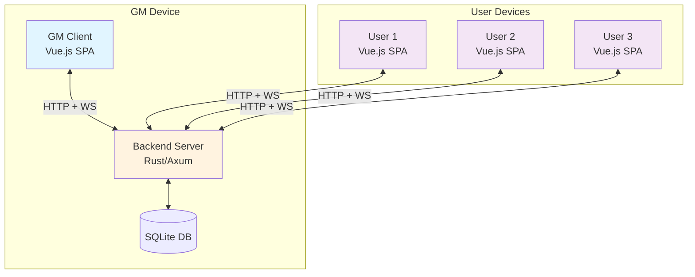
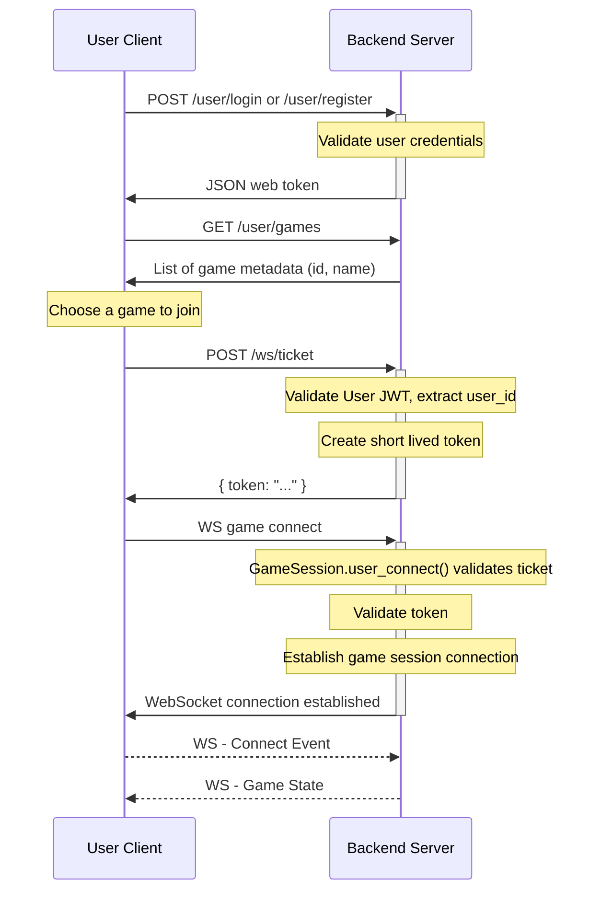

# Architecture

See also:

- [Documentation Index](README.md)
- [Backend Documentation](backend/README.md)
- [API and Realtime](API.md)
- [Plugin Documentation](backend/plugins/README.md)

## System Overview

```mermaid
graph TB
    subgraph "GM Device"
        GM[GM Client<br/>Vue.js SPA]
        Backend[Backend Server<br/>Rust/Axum]
        DB[(SQLite DB)]

        GM <-->|HTTP + WS| Backend
        Backend <--> DB
    end

    subgraph "User Devices"
        User1[User 1<br/>Vue.js SPA]
        User2[User 2<br/>Vue.js SPA]
        User3[User 3<br/>Vue.js SPA]
    end

    User1 <-->|HTTP + WS| Backend
    User2 <-->|HTTP + WS| Backend
    User3 <-->|HTTP + WS| Backend

    style GM fill:#e1f5ff
    style Backend fill:#fff3e0
    style User1 fill:#f3e5f5
    style User2 fill:#f3e5f5
    style User3 fill:#f3e5f5
```

## User Auth / Game Join

```mermaid
sequenceDiagram
    participant User as User Client
    participant Backend as Backend Server

    User->>+Backend: POST /user/login or /user/register
    note over Backend: Validate user credentials
    Backend->>-User: JSON web token

    User->>Backend: GET /user/games
    Backend->>User: List of game metadata (id, name)
    note over User: Choose a game to join

    User->>+Backend: POST /ws/ticket
    note over Backend: Validate User JWT, extract user_id
    note over Backend: Create short lived token
    Backend->>-User: { token: "..." }

    User->>+Backend: WS game connect
    note over Backend: GameSession.user_connect() validates ticket
    note over Backend: Validate token
    note over Backend: Establish game session connection
    Backend->>-User: WebSocket connection established

    User -->> Backend: WS - Connect Event
    Backend -->> User: WS - Game State
```
