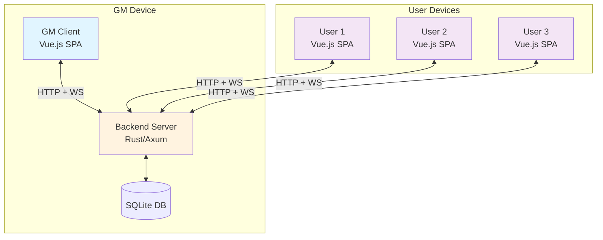
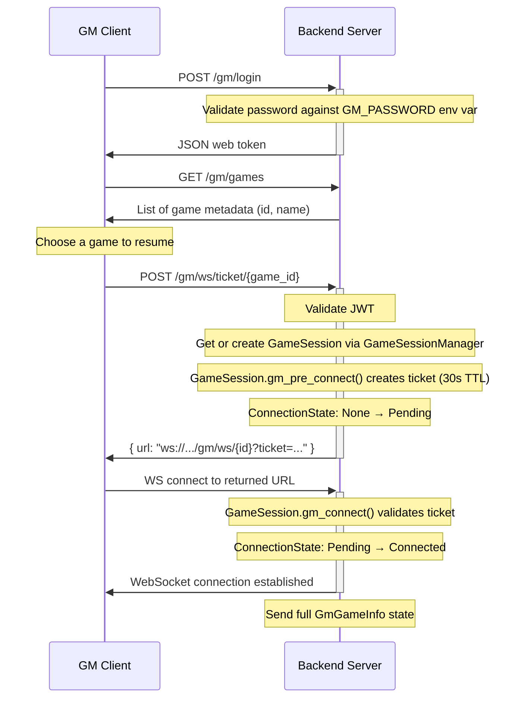
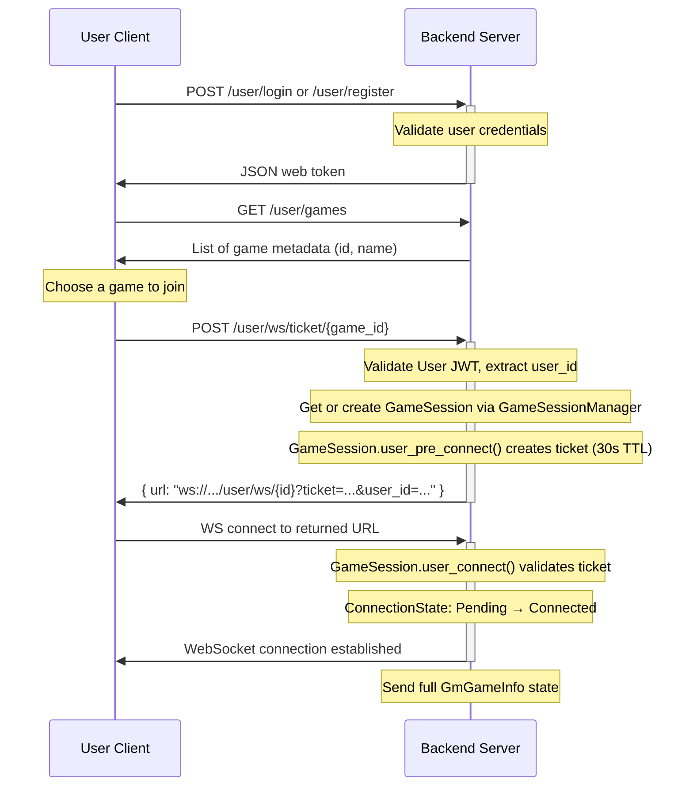

# Architecture

See also:

- [Documentation Index](README.md)
- [Backend Documentation](backend/README.md)
- [API and Realtime](API.md)
- [Plugin Documentation](backend/plugins/README.md)

## System Overview

```mermaid
graph TB
    subgraph "GM Device"
        GM[GM Client<br/>Vue.js SPA]
        Backend[Backend Server<br/>Rust/Axum]
        DB[(SQLite DB)]

        GM <-->|HTTP + WS| Backend
        Backend <--> DB
    end

    subgraph "User Devices"
        User1[User 1<br/>Vue.js SPA]
        User2[User 2<br/>Vue.js SPA]
        User3[User 3<br/>Vue.js SPA]
    end

    User1 <-->|HTTP + WS| Backend
    User2 <-->|HTTP + WS| Backend
    User3 <-->|HTTP + WS| Backend

    style GM fill:#e1f5ff
    style Backend fill:#fff3e0
    style User1 fill:#f3e5f5
    style User2 fill:#f3e5f5
    style User3 fill:#f3e5f5
```

## GM Auth / Game Start

```mermaid
sequenceDiagram
    participant GM as GM Client
    participant Backend as Backend Server

    GM->>+Backend: POST /gm/login
    note over Backend: Validate password against GM_PASSWORD env var
    Backend->>-GM: JSON web token

    GM->>Backend: GET /gm/games
    Backend->>GM: List of game metadata (id, name)
    note over GM: Choose a game to resume

    GM->>+Backend: POST /gm/ws/ticket/{game_id}
    note over Backend: Validate JWT
    note over Backend: Get or create GameSession via GameSessionManager
    note over Backend: GameSession.gm_pre_connect() creates ticket (30s TTL)
    note over Backend: ConnectionState: None → Pending
    Backend->>-GM: { url: "ws://.../gm/ws/{id}?ticket=..." }

    GM->>+Backend: WS connect to returned URL
    note over Backend: GameSession.gm_connect() validates ticket
    note over Backend: ConnectionState: Pending → Connected
    Backend->>-GM: WebSocket connection established
    note over Backend: Send full GmGameInfo state
```

## User Auth / Game Join

```mermaid
sequenceDiagram
    participant User as User Client
    participant Backend as Backend Server

    User->>+Backend: POST /user/login or /user/register
    note over Backend: Validate user credentials
    Backend->>-User: JSON web token

    User->>Backend: GET /user/games
    Backend->>User: List of game metadata (id, name)
    note over User: Choose a game to join

    User->>+Backend: POST /user/ws/ticket/{game_id}
    note over Backend: Validate User JWT, extract user_id
    note over Backend: Get or create GameSession via GameSessionManager
    note over Backend: GameSession.user_pre_connect() creates ticket (30s TTL)
    Backend->>-User: { url: "ws://.../user/ws/{id}?ticket=...&user_id=..." }

    User->>+Backend: WS connect to returned URL
    note over Backend: GameSession.user_connect() validates ticket
    note over Backend: ConnectionState: Pending → Connected
    Backend->>-User: WebSocket connection established
    note over Backend: Send full GmGameInfo state
```

## Command Flow

The backend accepts game commands via WebSocket and then broadcasts full projected game state to connected clients.
