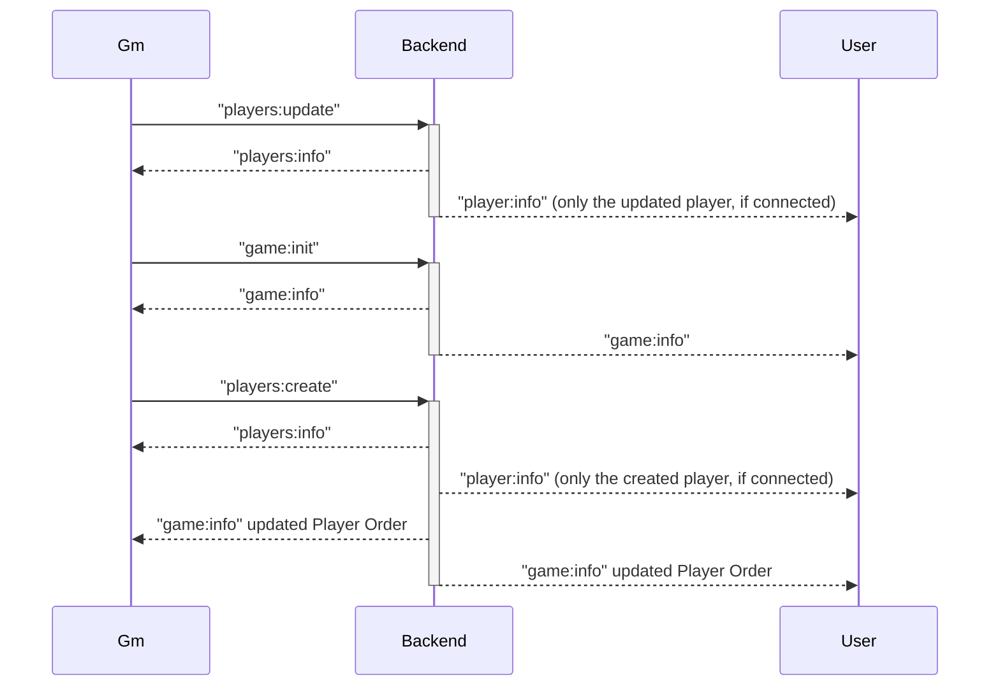
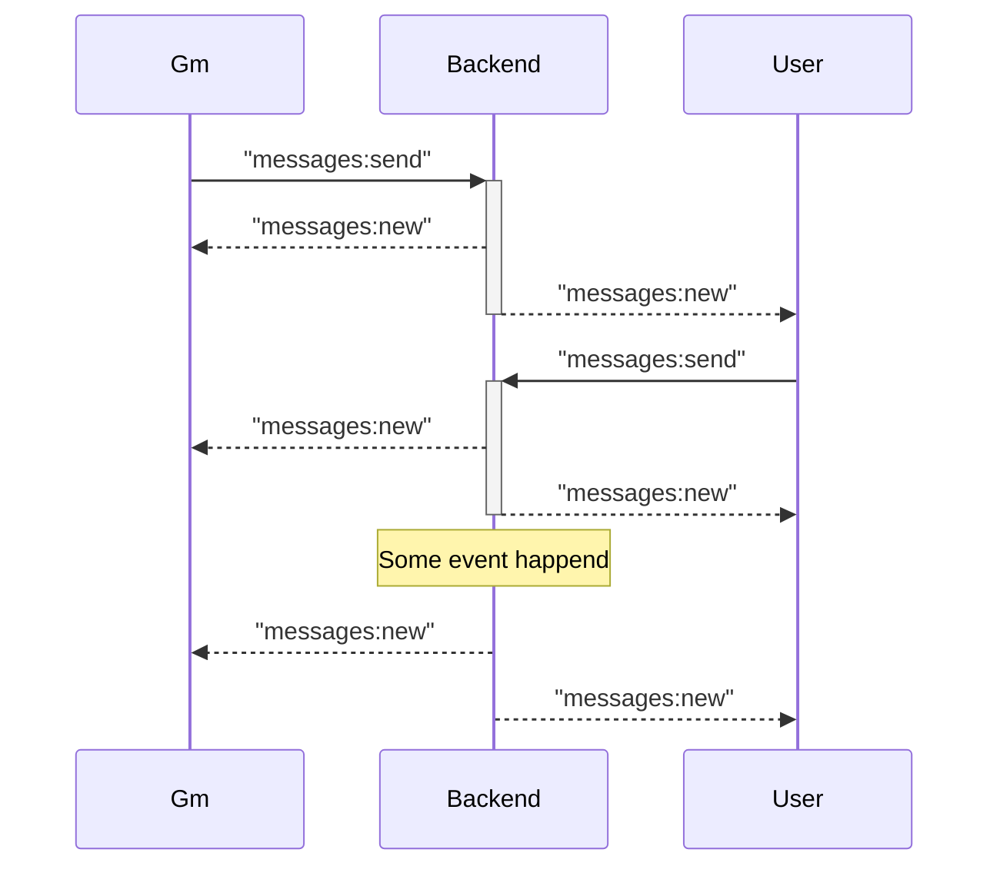
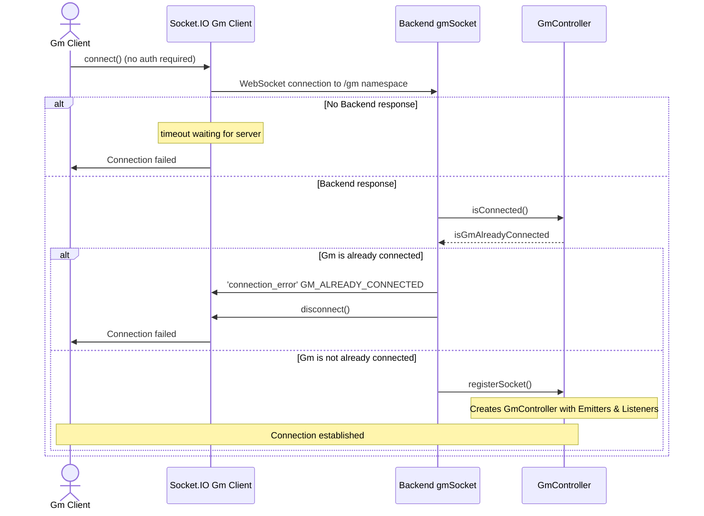
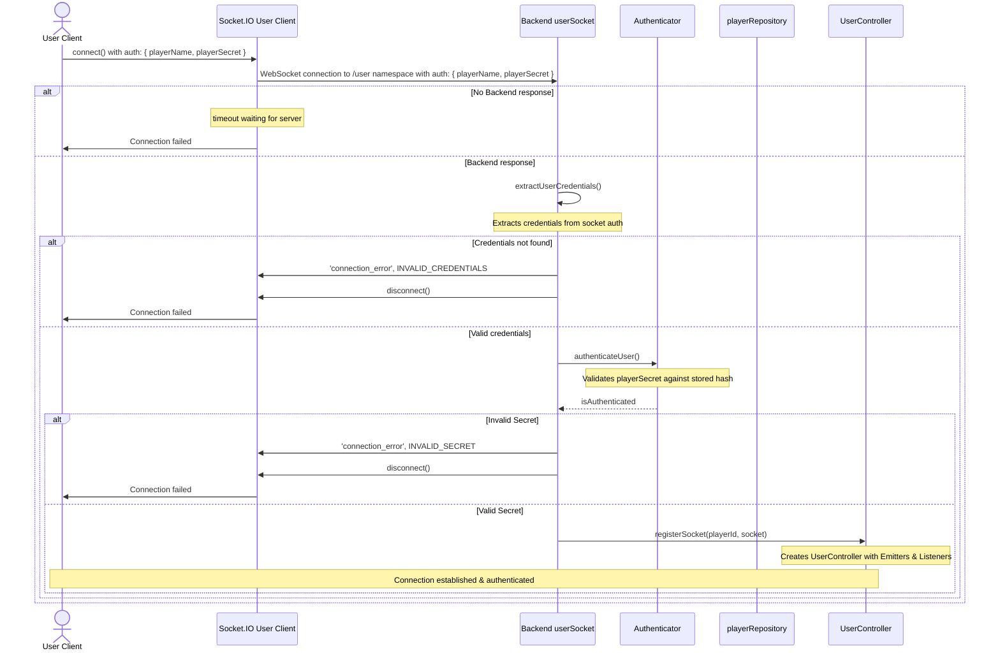

# Turnkeeper architecture

The Turnkeeper application is split into three parts: the backend, the game master (frontend) and the user (frontend). The game master and users are connecting to the backend via socket.io.

## Basic backend - gm/user socket event sequence



## Messages event sequence



## Gm connection



## User connection



## Backend Architecture

### Overview

The backend follows a layered architecture pattern with clear separation of concerns:

```
┌─────────────────────────────────────────────────────┐
│                   Socket Layer                      │
│            (gmSocket.ts, userSocket.ts)             │
└────────────────────┬────────────────────────────────┘
                     │
┌────────────────────▼────────────────────────────────┐
│                Controller Layer                      │
│         (GmController, UserController)              │
│  • Manages socket instances (singleton/multi)       │
│  • Initializes Emitters and Listeners               │
└────────────┬─────────────────────┬──────────────────┘
             │                     │
┌────────────▼──────────┐ ┌───────▼──────────────────┐
│   Emitter Classes     │ │   Listener Classes       │
│ • Send data to clients│ │ • Handle incoming events │
│ • One per feature     │ │ • One per feature        │
└────────────┬──────────┘ └───────┬──────────────────┘
             │                     │
             └──────────┬──────────┘
                        │
┌───────────────────────▼─────────────────────────────┐
│                  Service Layer                       │
│  (gameStateHandler, playersHandler, messagesHandler) │
│  • Business logic                                    │
│  • Coordinates repositories and emitters             │
└────────────────────────┬────────────────────────────┘
                         │
┌────────────────────────▼────────────────────────────┐
│                Repository Layer                      │
│  (gameStateRepository, playerRepository, etc.)      │
│  • Data access logic                                 │
│  • Direct database operations                        │
└────────────────────────┬────────────────────────────┘
                         │
┌────────────────────────▼────────────────────────────┐
│                  Database Layer                      │
│              (SqliteDatabase singleton)              │
└─────────────────────────────────────────────────────┘
```

### Socket Namespaces

The application uses two Socket.IO namespaces:

-   **`/gm` namespace**: Single GM connection (singleton pattern)
-   **`/user` namespace**: Multiple user connections (one per player)

### Controllers

Controllers manage WebSocket connections and coordinate emitters/listeners.

#### GmController (Singleton)

-   Only one GM can be connected at a time
-   Static methods: `getInstance()`, `isConnected()`, `registerSocket()`, `unregisterSocket()`
-   Instantiates:
    -   **Emitters**: `GmGameEmitter`, `GmPlayersEmitter`, `GmLogsEmitter`, `GmMessagesEmitter`
    -   **Listeners**: `GmGameListener`, `GmPlayersListener`, `GmMessagesListener`

#### UserController (Multi-instance)

-   One instance per connected player (Map-based storage by playerId)
-   Static methods: `getInstance(playerId)`, `getAllInstances()`, `isConnected(playerId)`, `registerSocket()`, `unregisterSocket()`
-   Each instance instantiates:
    -   **Emitters**: `UserGameEmitter`, `UserPlayersEmitter`, `UserMessagesEmitter`
    -   **Listeners**: `UserMessagesListener`

### Emitters

Emitters send data from the backend to connected clients. Each emitter handles a specific domain.

#### GM Emitters

-   **GmGameEmitter**: Sends game state info (`game:info`)
-   **GmPlayersEmitter**: Sends all players info (`players:info`)
-   **GmLogsEmitter**: Sends log entries (`logs:new`)
-   **GmMessagesEmitter**: Sends new messages (`messages:new`)

#### User Emitters

-   **UserGameEmitter**: Sends game state info to user (`game:info`)
-   **UserPlayersEmitter**: Sends player's own info (`player:info`)
-   **UserMessagesEmitter**: Sends messages to specific player (`messages:new`)

### Listeners

Listeners handle incoming socket events from clients. Each listener registers event handlers for a specific domain.

#### GM Listeners

-   **GmGameListener**: Handles game state events (init, update, advance turn, etc.)
-   **GmPlayersListener**: Handles player CRUD operations
-   **GmMessagesListener**: Handles GM sending messages

#### User Listeners

-   **UserMessagesListener**: Handles user sending messages

### Services

Services contain business logic and orchestrate data flow between repositories and emitters.

-   **gameStateHandler**: Manages game state, turn order, round tracking
-   **playersHandler**: Handles player creation, updates, deletion
-   **messagesHandler**: Routes messages between GM and users
-   **logger**: Logging service for application events
-   **statsHandler**: Manages player statistics

### Repositories

Repositories provide data access abstraction over the SQLite database.

-   **gameStateRepository**: CRUD for game state (turn order, current turn, round)
-   **playerRepository**: CRUD for players (name, HP, initiative, secret)
-   **messageRepository**: CRUD for messages between GM and players
-   **statsRepository**: CRUD for player statistics (key-value pairs)

### Database

**SqliteDatabase**: Singleton wrapper around `better-sqlite3`

-   Manages single database connection
-   Initializes tables on startup
-   Located at path defined in config
