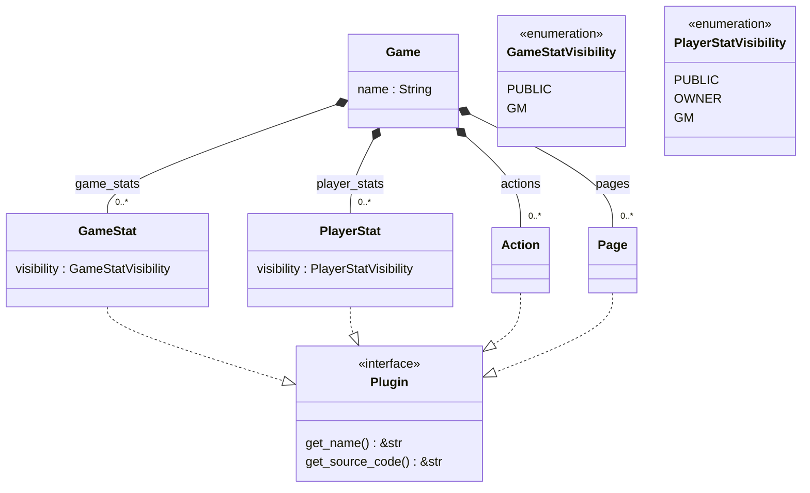

# The Game

The `Game` is a collection of plugins and configuration describing a specific board game. It serves as a blueprint for the `GameInstance`.

## Structure

## Plugins

The Plugins are the core defining elements of each game.

First the [State](./plugins/State.md) provides the data stores for game state persistance. It describes what should be saved in the game. For example the field _gold_ for each player.

The [Actions](./plugins/Command.md) then add functionality to the game. They are the fundamental operations performed in a game and change the game state. Actions can call other actions from within and might have a trigger (global event like TurnStart or other action). Examples might be _SendGold_, _OnTurnStart_, _CollectTaxes_.

Last but not least the [Pages](./plugins/Page.md) describe what the players see. Each game has to have a main page. Pages can be created for everyone, only players or only the gm (a game doesn't have to have a gm).
