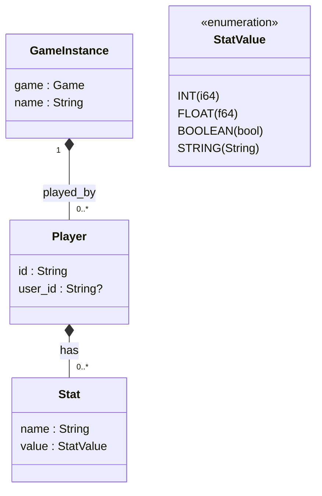

# The Game Instance

The `GameInstance` is a specific instance of a game, played with some users. It contains a snapshot of the `Game` - to avoid invalid game states, when the blueprint changes during a game - and the current state of the played game.

## Structure

