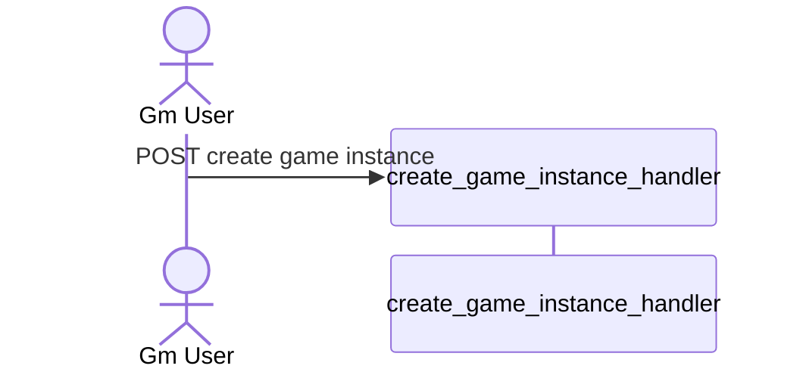
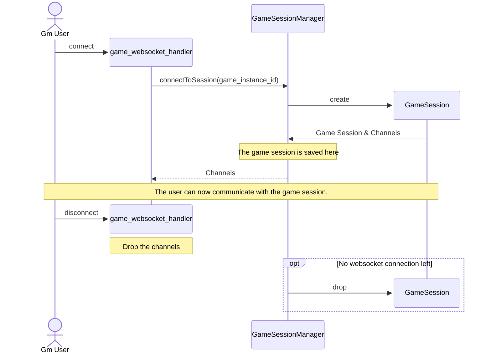

# Playing a Game

## Creating a game instance

```mermaid
sequenceDiagram
    actor GM as Gm User

    create participant HTTP as create_game_instance_handler
    GM ->> HTTP : POST create game instance

```

## Starting the game

When playing a game the users can connect to it via WebSocket. If the game session is not running a new one is created.

```mermaid
sequenceDiagram
    actor GM as Gm User

    create participant WS as game_websocket_handler
    GM ->> WS : connect

    participant SM as GameSessionManager
    WS ->> SM : connectToSession(game_instance_id)

    create participant S as GameSession
    SM ->> S : create
    S -->> SM : Game Session & Channels
    note over SM : The game session is saved here
    SM -->> WS : Channels

    note over GM, S : The user can now communicate with the game session.

    destroy WS
    GM ->> WS : disconnect
    note over WS : Drop the channels

    opt No websocket connection left
        destroy S
        SM ->> S : drop
    end
```
