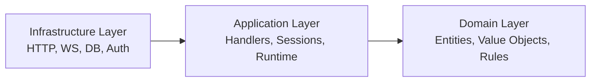

# Backend Layers

The backend follows a strict inward dependency rule:

- `Infrastructure` depends on `Application`
- `Application` depends on `Domain`
- `Domain` does not depend on outer layers

Layer deep dives:

- [Domain Layer](domain.md)
- [Application Layer](application.md)
- [Infrastructure Layer](infrastructure.md)
