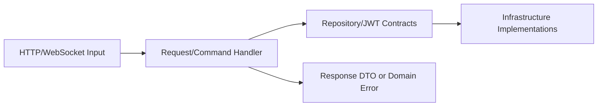
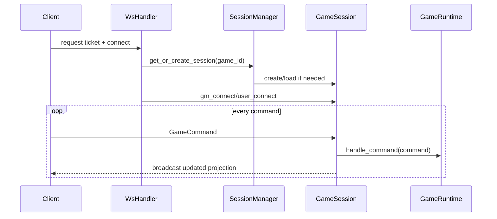

# Application Layer

The application layer orchestrates use cases and stateful game sessions.

## Modules

- `application/user`: register, login, authenticate, list users
- `application/gm`: GM login and JWT validation use cases
- `application/game`: game create/delete/overview + runtime + session lifecycle
- `application/plugin`: plugin lexer/parser/runtime/debugger
- `application/common`: connection abstractions

## Request Handler Pattern for non-stateful Requests

Each use case is represented by a handler that depends on contracts.

## Stateful Realtime Game Management

