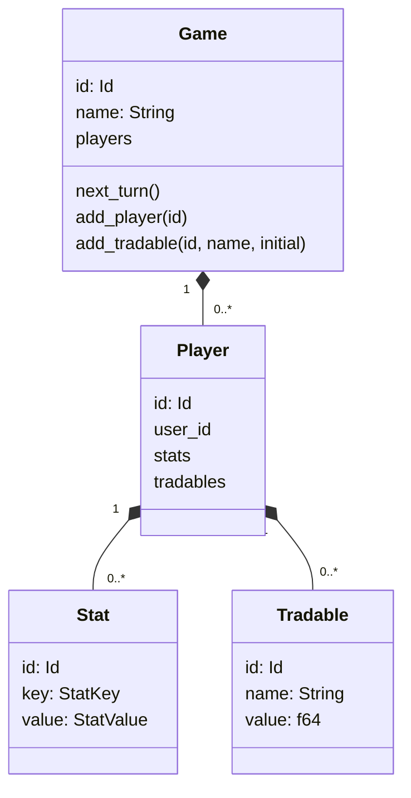
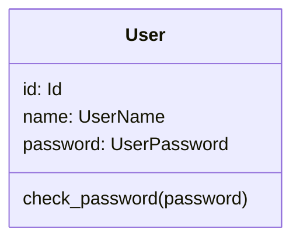

# Domain Layer

The domain layer models core game and user rules **without outside dependencies**.

## Modules

- `domain/user`
- `domain/game`
- `domain/gm`

## Game Aggregate

## User Aggregate

## Invariants and Rules

- Game identity and user identity are UUID-based IDs.
- Domain constructors and value objects enforce validation boundaries.
- Domain methods return domain-specific errors instead of infra errors.
- User management is separate from the game aggregate; game uses user identity references.

## Projections

The clients don't get to see the game aggregate itself. They only get a projection. This projection differs depending on who wants to see the game state. This way we seperate the connection from the actual data.
