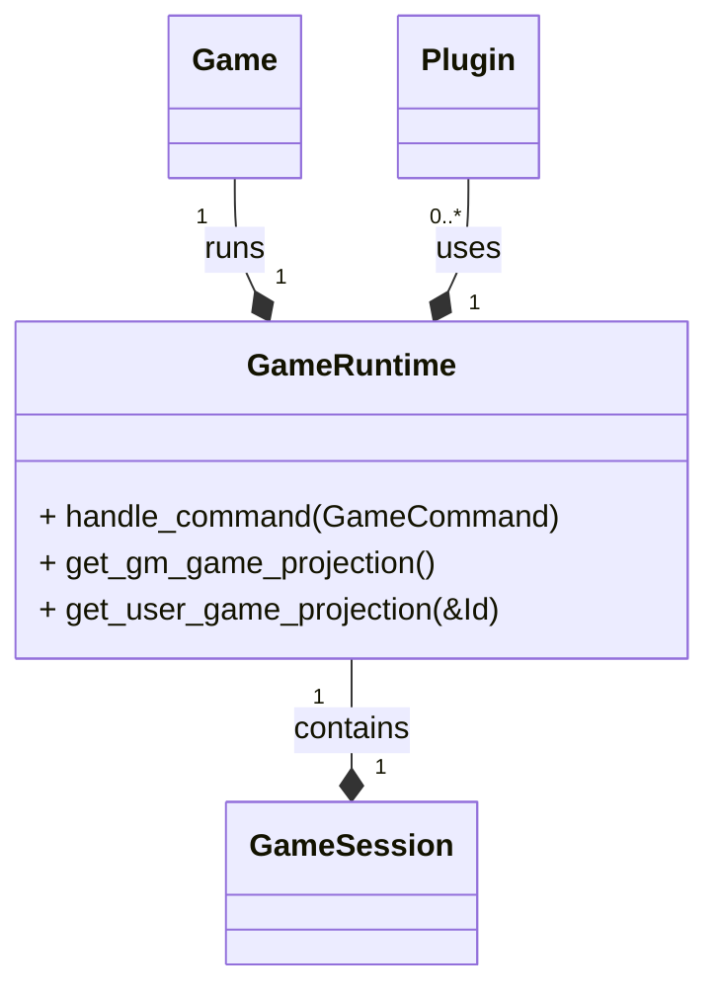
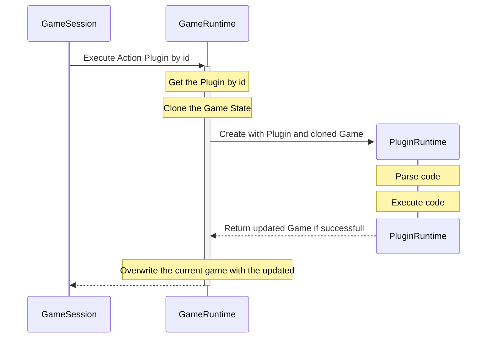

# Game Session

See also:

- [Plugin Docs Index](../README.md)
- [Plugin Overview](../OVERVIEW.md)
- [Grammar](../GRAMMAR.md)
- [Pages](../PAGES.md)

## Action plugin execution

## Related Project Docs

- [Main Documentation Index](../../README.md)
- [Architecture](../../ARCHITECTURE.md)
