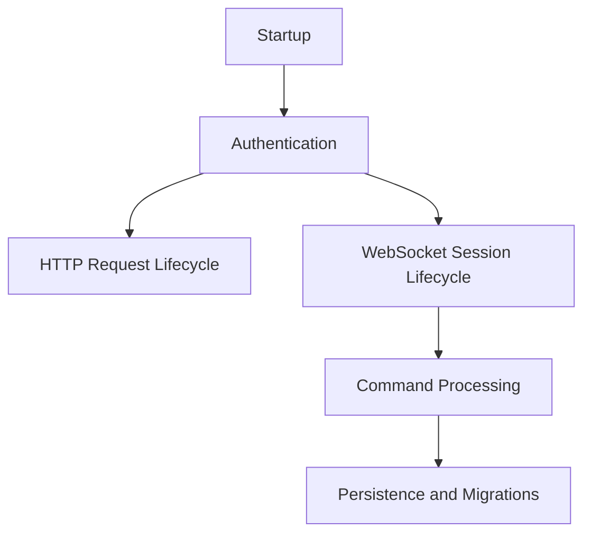

# Backend Processes

This section documents noteworthy backend runtime processes.

## Process Documents

- [Startup and Bootstrapping](startup.md)
- [Authentication and Authorization](authentication.md)
- [HTTP Request Lifecycle](http-request-lifecycle.md)
- [WebSocket Session Lifecycle](websocket-session-lifecycle.md)
- [Command Processing and Broadcast](command-processing.md)
- [Persistence and Migrations](persistence-and-migrations.md)

