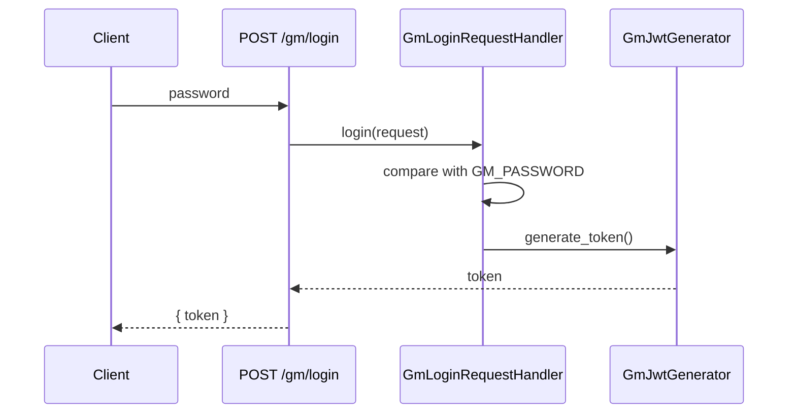
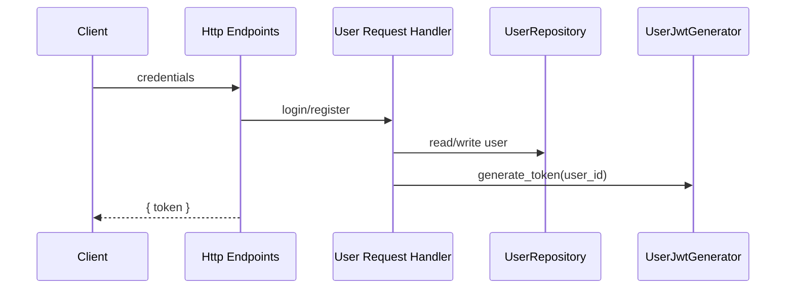
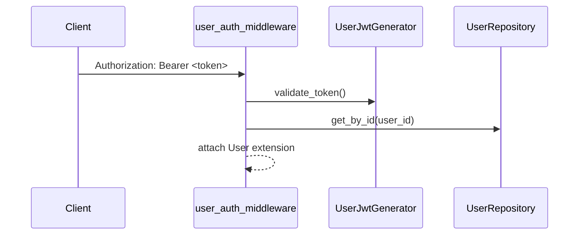

# Authentication and Authorization

The backend has two auth domains: GM and User.

- GM auth uses `GM_PASSWORD` + GM JWT
- User auth uses username/password + User JWT

## GM Login Flow

## User Login/Register

## Authorization Flow

