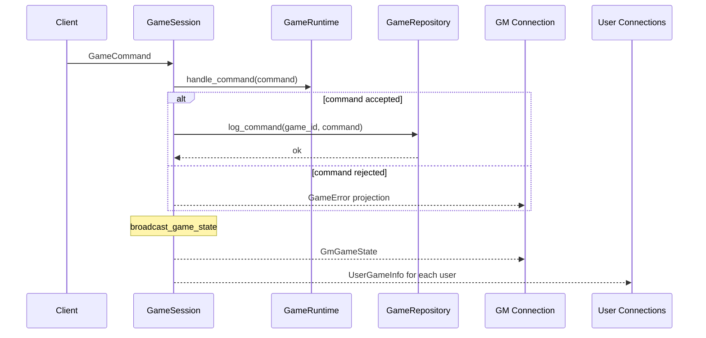
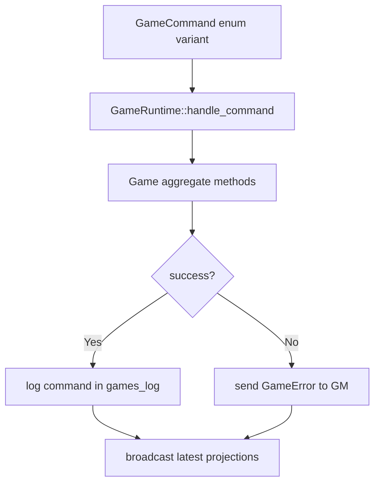

# Command Processing and Broadcast

Commands enter through active WebSocket connections and are processed by `GameSession` and `GameRuntime`.

## Command Pipeline

## Command Source and Permission Notes

- GM connections can submit all game commands.
- User connections are checked by `command.is_user_permitted(user_id)` before execution.

## Runtime Dispatch Model

