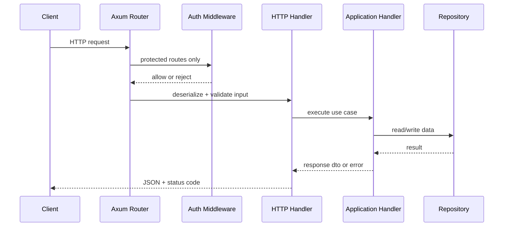
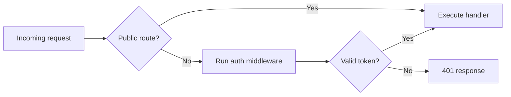

# HTTP Request Lifecycle

HTTP routes are declared in `infrastructure/http/mod.rs` and merged in `build_app`.

## Route Groups

- GM routes: `/gm/*`
- User routes: `/user/*`

## Generic Handler Lifecycle

## Protected Route Model

## Error Translation

Domain and application errors are converted to HTTP-safe errors by infrastructure error mapping modules.
