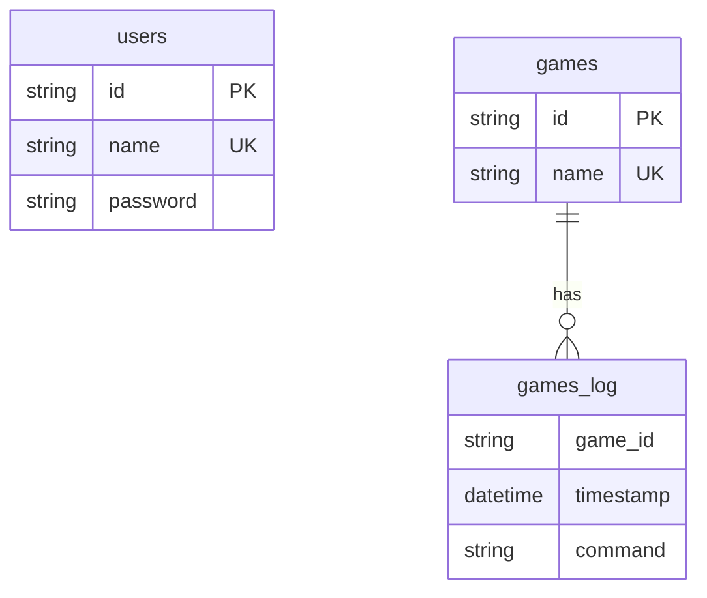
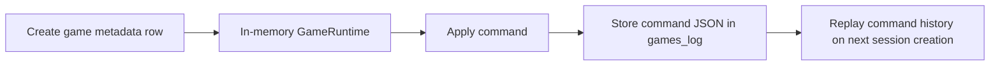

# Persistence and Migrations

Persistence is implemented with SQLx + SQLite and command logging for game state reconstruction.

## Schema Overview

## Repository Layout

- `SqliteUserRepository`: CRUD-like user access
- `SqliteGameRepository`: game metadata and command log
- `RepositoryManager`: shared access point injected into app state

## Event-Log Style Game Persistence

