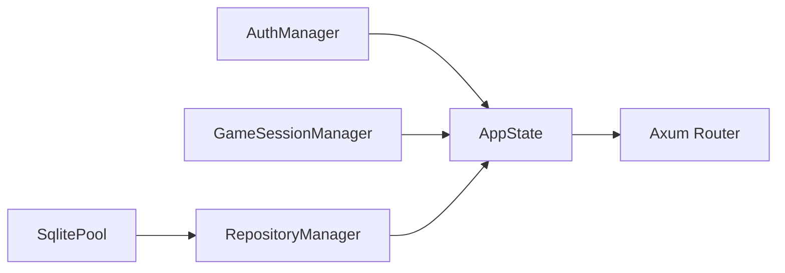

# Startup and Bootstrapping

The backend startup flow is implemented in `backend/src/main.rs`, `backend/src/lib.rs` and `infrastructure/persistence/db.rs`.

## Runtime State Built at Boot

## Failure Points

- missing `.env` in local setup
- invalid/missing env variables (`GM_PASSWORD`, JWT secrets)
- DB connection/migration failure
- TCP bind failure on port `8080`
