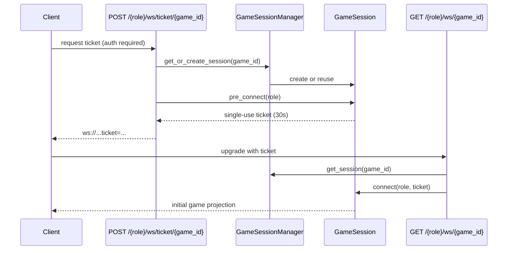
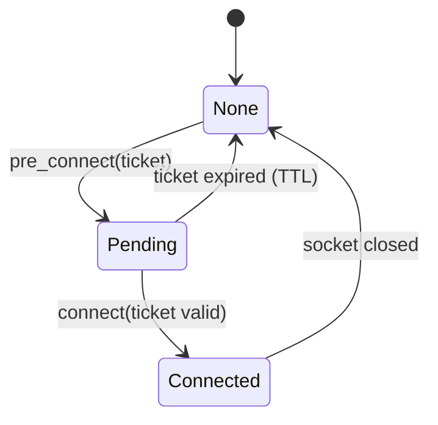
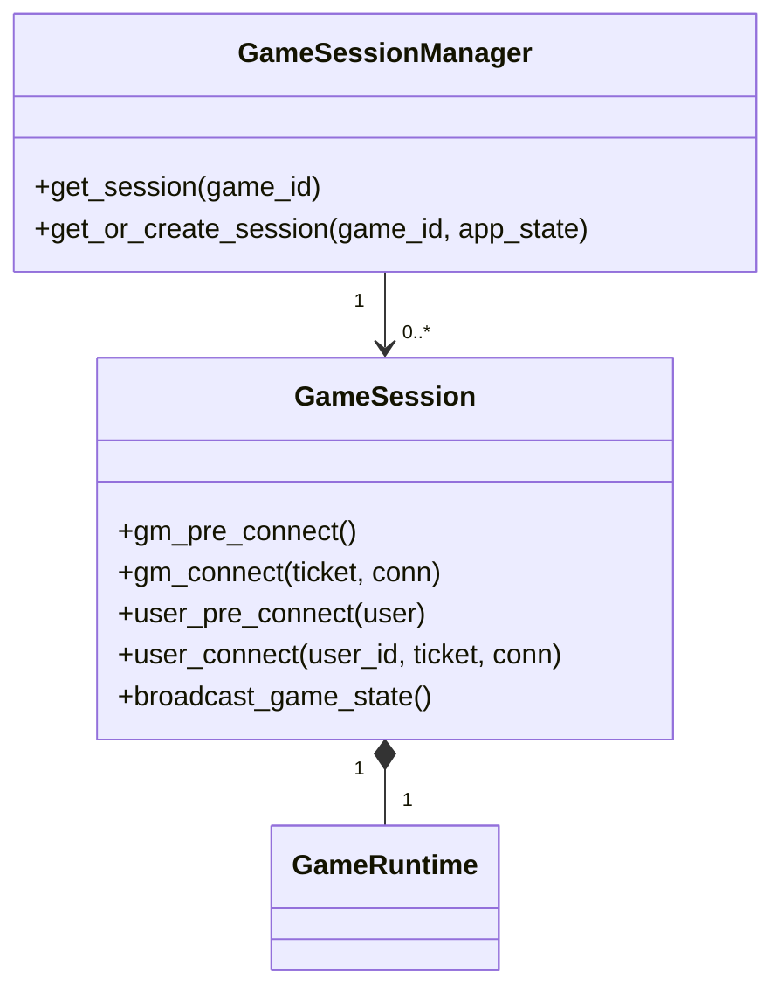

# WebSocket Session Lifecycle

Realtime connections are coordinated by the `GameSessionManager`.

## Ticket + Connect Flow

```mermaid
sequenceDiagram
    participant Client
    participant TicketApi as POST /{role}/ws/ticket/{game_id}
    participant SessionMgr as GameSessionManager
    participant Session as GameSession
    participant WsApi as GET /{role}/ws/{game_id}

    Client->>TicketApi: request ticket (auth required)
    TicketApi->>SessionMgr: get_or_create_session(game_id)
    SessionMgr->>Session: create or reuse
    TicketApi->>Session: pre_connect(role)
    Session-->>TicketApi: single-use ticket (30s)
    TicketApi-->>Client: ws://...ticket=...

    Client->>WsApi: upgrade with ticket
    WsApi->>SessionMgr: get_session(game_id)
    WsApi->>Session: connect(role, ticket)
    Session-->>Client: initial game projection
```

## Connection State Model

```mermaid
stateDiagram-v2
    [*] --> None
    None --> Pending: pre_connect(ticket)
    Pending --> Connected: connect(ticket valid)
    Pending --> None: ticket expired (TTL)
    Connected --> None: socket closed
```

## Session Ownership Model

```mermaid
classDiagram
    class GameSessionManager {
      +get_session(game_id)
      +get_or_create_session(game_id, app_state)
    }

    class GameSession {
      +gm_pre_connect()
      +gm_connect(ticket, conn)
      +user_pre_connect(user)
      +user_connect(user_id, ticket, conn)
      +broadcast_game_state()
    }

    class GameRuntime

    GameSessionManager "1" --> "0..*" GameSession
    GameSession "1" *-- "1" GameRuntime
```
