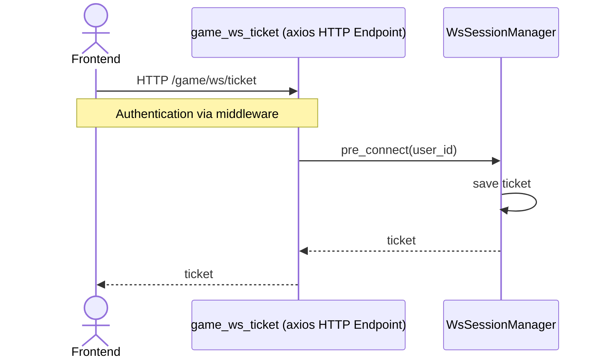
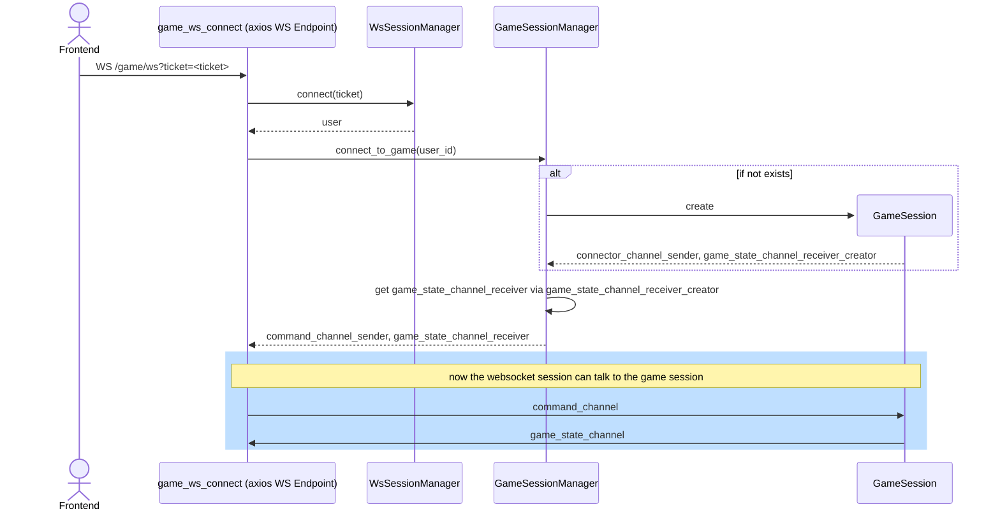

# Websocket Session

### WsConnection

Using the game ws connection as an example - it works the same for the other ws connections.

The WsSessionManager is shared between the websocket use cases, since every one needs to get the user and entries in the WsSessionManager do not interfere with each other.

#### Get the ticket

Js Websockets do not support headers. We don't want to send the users jwt in the url, so we use a ticket endpoint. It serves the purpose of authorizing the user and creating a short-lived ticket used to connect to the websocket.

The ticket and corresponding information (user information) is saved in the WsSessionManager to be used after the connect.

#### Connect

> Blue sections are communications via channels

